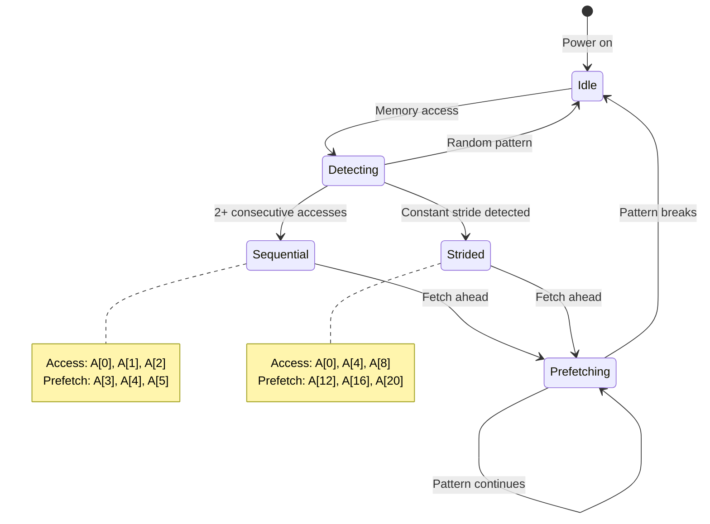

# Chapter 2: Memory Hierarchy

**Part I: Foundations**

---

> "Memory is the new disk, disk is the new tape."
> — Jim Gray

## 100-Cycle 問題

在第一章，我們看到 cache misses 要花 100-200 cycles，而 cache hits 只要 1-4 cycles。這不是個小細節——這是現代性能最重要的因素。

讓我告訴你為什麼。

我當時正在優化一個 RISC-V 嵌入式系統的 device driver。這個 driver 需要處理來自網路介面的 packets，但我們在負載下會掉 packets。CPU 跑在 1 GHz，每個 packet 需要大約 500 個 instructions 來處理。簡單的數學：

```
500 instructions ÷ 1 GHz = 500 nanoseconds per packet
```

以 500 ns per packet 來算，我們應該能處理每秒 200 萬個 packets。但我們實際上只能處理每秒 20 萬個 packets——比預期慢了 10 倍。

Profiler 告訴了我們答案：

```bash
$ perf stat -e cycles,instructions,cache-misses ./driver_test
  Performance counter stats:
    5,000,000 cycles
      500,000 instructions
       45,000 cache-misses
```

等等。500,000 個 instructions 應該要花 500,000 cycles（以 1 IPC 計算）。但我們看到 5,000,000 cycles。多出來的 4.5 million cycles 去哪了？

**Cache misses**: 45,000 misses × 100 cycles = 4,500,000 cycles

Cache misses 主導了我們的執行時間。實際的運算（500,000 cycles）只佔總時間的 10%。另外 90% 都在等記憶體。

這就是現代運算的現實：**記憶體很慢，而且相對於 CPU 速度越來越慢**。

## Memory Hierarchy

現代電腦沒有「記憶體」——它們有一個記憶體的 **hierarchy**，每一層都有不同的速度和大小：

| Level | Type | Latency | Size |
|-------|------|---------|------|
| Registers | 32 registers | 1 cycle | ~128 B |
| L1 Cache | Split I/D | 3-4 cycles | 32-64 KB |
| L2 Cache | Unified | 12-15 cycles | 256-512 KB |
| L3 Cache (if present) | Shared | 40-50 cycles | 2-32 MB |
| DRAM | Main memory | 100-200 cycles | GB-TB |

**關鍵觀察**：

1. **速度遞減**：往下走越來越慢（1 → 200 cycles）
2. **大小遞增**：往下走越來越大（128 B → GB）
3. **差距巨大**：DRAM 比 L1 慢 100-200 倍

在嵌入式系統上，hierarchy 通常更簡單：

**典型的 MCU（例如：RISC-V RV32IMC @ 100 MHz）**：

| Level | Type | Latency | Size |
|-------|------|---------|------|
| Registers | 32 registers | 1 cycle | 128 B |
| L1 I-Cache | Instruction | 1 cycle | 16 KB |
| L1 D-Cache/SRAM | Data | 1-2 cycles | 8-32 KB |
| Flash | Code storage | ~10 cycles | 128 KB - 1 MB |
| External DRAM (optional) | Data (if present) | 50-100 cycles | 8-64 MB |

**嵌入式系統的差異**：
- 更小的 caches（8-64 KB vs 256 KB-32 MB）
- 通常沒有 L2/L3 cache
- 用 Flash memory 而不是 DRAM 存放程式碼
- 更緊的記憶體預算

## Cache Lines: 基本單位

這是關鍵洞察：**Caches 不會抓取單一 bytes——它們抓取 cache lines**。

一個 cache line 在現代處理器上通常是 **64 bytes**（桌面和嵌入式都一樣）。當你存取一個 byte 時，硬體會抓取包含那個 byte 的整個 64-byte 區塊。

**範例**：存取一個整數

```c
int x = array[0];  // 存取 address 0x1000 的 4 bytes
```

實際上發生的事：

```
CPU requests: 4 bytes at 0x1000
Cache fetches: 64 bytes from 0x1000 to 0x103F
```

Cache line 包含：
- 被要求的整數（4 bytes）
- 接下來的 15 個整數（60 bytes）

這就是為什麼**循序存取很快**：

```c
// 快：全部在同一個 cache line
for (int i = 0; i < 16; i++) {
    sum += array[i];  // 第一次 miss，接下來 15 次都 hit
}
```

第一次存取 `array[0]` 會 miss cache，但會抓取整個 cache line（`array[0]` 到 `array[15]`）。接下來的 15 次存取都會 hit cache。

**Cache line 的影響**：

1. **Spatial locality 很重要**：存取附近的資料很便宜
2. **浪費很常見**：如果你只用 4 bytes，其他 60 bytes 就浪費了
3. **Alignment 很重要**：跨越 cache line 邊界會造成兩次 fetch

但**隨機存取很慢**：

```c
// 慢：每次存取可能在不同的 cache line
for (int i = 0; i < 16; i++) {
    sum += array[random_index[i]];  // 每次存取：可能 miss
}
```

## Cache Organization

Caches 被組織成 **sets** 和 **ways**。理解這個有助於解釋 cache conflicts。

**Direct-mapped cache** (1-way)：

```
Address bits: [     Tag      |   Index   |      Offset      ]
               └─────────────┴───────────┴──────────────────
               Identifies     Selects     Byte within
               cache line     set         cache line
```

**範例**：32 KB cache，64-byte lines，direct-mapped
- Cache lines: 32 KB ÷ 64 B = 512 lines
- Index bits: log₂(512) = 9 bits
- Offset bits: log₂(64) = 6 bits
- Tag bits: 剩餘的 bits（例如：32-bit address 的話是 32 - 9 - 6 = 17 bits）

**Direct-mapped 的問題**：Cache conflicts

```c
int a[1024];  // 在 address 0x10000
int b[1024];  // 在 address 0x18000

// 這兩個 arrays 會 map 到同樣的 cache sets！
// 0x10000 和 0x18000 只有 bit 15 不同
// Index 使用 bits 6-14，所以它們會碰撞
```

**Set-associative cache**（N-way）：

一個 4-way set-associative cache 每個 set 有 4 個「slots」：

```
Set 0: [Line 0] [Line 1] [Line 2] [Line 3]
Set 1: [Line 0] [Line 1] [Line 2] [Line 3]
...
```

當 address map 到 Set 0 時，它可以放在 4 個 slots 的任何一個。這減少了 conflicts。

**典型配置**：
- L1: 8-way set-associative（32-64 KB）
- L2: 8-16-way set-associative（256-512 KB）
- L3: 16-way set-associative（2-32 MB）

**嵌入式系統**：
- 通常是 direct-mapped 或 2-way（更簡單的硬體）
- 更小的 caches 意味著更多 conflicts

## Spatial 和 Temporal Locality

Cache 性能取決於兩種 locality：

**Spatial locality**：存取附近的 addresses
```c
// 良好的 spatial locality
for (int i = 0; i < n; i++) {
    sum += array[i];  // 循序存取
}

// 差的 spatial locality
for (int i = 0; i < n; i++) {
    sum += array[random[i]];  // 隨機存取
}
```

**Temporal locality**：重複存取同一個 address
```c
// 良好的 temporal locality
int temp = array[0];
for (int i = 0; i < 1000; i++) {
    result += temp * i;  // 重複使用 'temp'
}

// 差的 temporal locality
for (int i = 0; i < 1000; i++) {
    result += array[i % 10] * i;  // 在重複使用前就被 evict 了
}
```

**Cache-friendly 的程式碼**同時利用兩者：

```c
// Matrix multiplication: cache-friendly 版本
for (int i = 0; i < N; i++) {
    for (int k = 0; k < N; k++) {
        int r = A[i][k];
        for (int j = 0; j < N; j++) {
            C[i][j] += r * B[k][j];  // B 有良好的 spatial locality
        }
    }
}
```

## Prefetcher

現代 CPU 有 **hardware prefetchers**，會預測記憶體存取模式，在你需要之前就抓取資料。

**Prefetcher 如何運作**：



**Sequential prefetcher**：偵測循序存取

```c
// Prefetcher 偵測到模式並提前抓取
for (int i = 0; i < n; i++) {
    sum += array[i];  // Prefetcher 抓取 array[i+1], array[i+2], ...
}
```

**Stride prefetcher**：偵測固定的 stride

```c
// Prefetcher 偵測到 stride 是 8 bytes
for (int i = 0; i < n; i++) {
    sum += array[i * 2];  // 存取每隔一個元素
}
```

**Prefetcher 的限制**：

1. **對隨機存取沒幫助**：
```c
for (int i = 0; i < n; i++) {
    sum += array[random[i]];  // 無法預測，沒有 prefetch
}
```

2. **有限的距離**：通常只能提前 10-20 個 cache lines

3. **可能被騙**：
```c
// 交替的模式會混淆 prefetcher
for (int i = 0; i < n; i++) {
    if (i % 2 == 0)
        sum += array[i];
    else
        sum += other_array[i];
}
```

**嵌入式系統**：很多 MCU **沒有 prefetcher** 或只有簡單的 sequential-only prefetcher。這讓循序存取變得更加關鍵。

## Memory Bandwidth

即使有完美的 cache 行為，你還是受限於 **memory bandwidth**。

**範例計算**（桌面系統）：
- DDR4-3200: 25.6 GB/s per channel
- Dual channel: 51.2 GB/s total
- L3 cache: ~200 GB/s
- L2 cache: ~400 GB/s
- L1 cache: ~1000 GB/s

**影響**：串流大型 arrays 會受限於 bandwidth

```c
// Bandwidth-limited: 串流 1 GB array
for (int i = 0; i < 256*1024*1024; i++) {
    array[i] = 0;  // 受限於 DRAM bandwidth
}
```

**嵌入式系統**的 bandwidth 低很多：
- 典型 MCU SRAM: 1-4 GB/s
- External DRAM（如果有的話）: 100-500 MB/s

這讓 **working set size** 變得關鍵——把資料保持在 on-chip SRAM 裡。

## Cache Coherency（Multi-core）

在 multi-core 系統上，caches 必須保持 **coherent**——所有 cores 看到一致的資料。

**MESI protocol**（常見於 x86、ARM）：
- **M**odified: 這個 cache 有唯一有效的 copy，已修改
- **E**xclusive: 這個 cache 有唯一有效的 copy，乾淨
- **S**hared: 多個 caches 有有效的 copies
- **I**nvalid: 這個 cache line 無效

**False sharing**：Multi-core 上的性能殺手

```c
// 不好：False sharing
struct {
    int counter_core0;  // Core 0 使用
    int counter_core1;  // Core 1 使用
} shared;  // 兩個都在同一個 cache line！

// Core 0 寫入 counter_core0 → 讓 core 1 的 cache line 失效
// Core 1 寫入 counter_core1 → 讓 core 0 的 cache line 失效
// Ping-pong 效應：性能很差
```

**解決方案**：Padding 到不同的 cache lines

```c
// 好：沒有 false sharing
struct {
    int counter_core0;
    char pad[60];       // Pad 到 64 bytes
    int counter_core1;
} shared;
```

**RISC-V**：使用 RVWMO（RISC-V Weak Memory Ordering），用 `fence` instructions 做同步。

## RISC-V Memory Model

RISC-V 有 **weak memory model**——記憶體操作可以被重新排序，除非你使用 fences。

**Memory ordering**：
```c
// 沒有 fence：這些可以被重新排序
store A
store B
load C
load D
```

**Fence instruction**：
```assembly
sw   a0, 0(a1)    # Store A
fence w, w        # 確保 store 完成後才做下一個 store
sw   a2, 0(a3)    # Store B
```

**Fence types**：
- `fence r, r`: Load-load fence
- `fence w, w`: Store-store fence
- `fence rw, rw`: Full fence
- `fence.i`: Instruction fence（用於 self-modifying code）

**Atomic operations**（A extension）：
```assembly
lr.w  a0, (a1)    # Load-reserved
# ... modify a0 ...
sc.w  a2, a0, (a1) # Store-conditional（如果 reservation 被破壞就失敗）
```

## 實用指南

基於對 memory hierarchy 的理解，這裡是資料結構設計的實用指南：

**1. 最小化 cache misses**
- 盡可能使用循序存取模式
- 保持 working set 小（塞進 L1/L2）
- 避免 pointer chasing（linked lists、trees）

**2. 利用 cache lines**
- 把相關的資料打包在一起（structs）
- 把資料結構對齊到 cache line 邊界
- 在 multi-core 上避免 false sharing

**3. 考慮 prefetcher**
- 使用可預測的存取模式
- 循序或固定 stride 的存取
- 盡可能避免隨機存取

**4. 了解你的硬體**
- Cache sizes（L1、L2、L3）
- Cache line size（通常是 64 bytes）
- Associativity（影響 conflicts）
- Prefetcher 能力

**5. 測量，不要猜測**
- 使用 `perf` 測量 cache misses
- 優化前先 profile
- 在目標硬體上測試

---

## Summary

100-cycle 問題透過理解 memory hierarchy 解決了。Device driver 的 packet loss 來自 45,000 次 cache misses 消耗了 4.5 million cycles——90% 的執行時間都在等記憶體。優化記憶體存取模式減少了 cache misses，把 throughput 從每秒 200,000 提升到預期的 200 萬個 packets。

Memory hierarchy 是現代電腦性能的基礎。Registers 提供 1-cycle 存取，L1 cache 提供 3-4 cycles，L2 cache 提供 12-15 cycles，L3 cache 提供 40-50 cycles，DRAM 需要 100-200 cycles。這個 100-200 倍的差距主導了性能。Caches 以 64-byte cache lines 運作，不是單一 bytes，這讓 spatial locality 變得關鍵——循序存取比隨機存取快 10-100 倍。

Hardware prefetchers 試圖預測記憶體存取模式並提前抓取資料，但它們只對可預測的模式有效（sequential 或 constant-stride access）。隨機存取會擊敗 prefetcher，導致每次存取都 miss。Memory bandwidth 也很重要——即使有完美的 cache 行為，串流大型資料集還是會受限於 DRAM bandwidth（桌面系統是 ~50 GB/s，嵌入式系統是 100-500 MB/s）。

嵌入式系統有更嚴苛的限制：更小的 caches（16-32 KB L1 vs 32-64 KB），通常沒有 L2/L3 cache，更慢的 DRAM（100 MHz vs 3 GHz），而且很多 MCU 沒有 prefetcher。這讓 working set size 和循序存取變得更加關鍵——如果你的資料無法塞進 16 KB L1 cache，性能就會崩潰。

Multi-core 系統引入了 cache coherency 的複雜性。MESI protocol 確保所有 cores 看到一致的資料，但 false sharing（多個 cores 寫入同一個 cache line 的不同部分）會造成 ping-pong 效應，嚴重降低性能。解決方案是把每個 core 的資料 padding 到不同的 cache lines。RISC-V 使用 weak memory model（RVWMO），需要明確的 `fence` instructions 來保證 memory ordering。

這些洞察直接影響資料結構設計。Arrays 贏過 linked lists，因為 spatial locality。小的 working sets 贏過大的，因為 temporal locality。循序存取贏過隨機存取，因為 prefetcher。但最重要的教訓是：測量，不要猜測。使用 `perf` 和其他 profiling 工具來測量 cache misses、bandwidth utilization 和實際性能。在下一章，我們會建立一個完整的 benchmarking framework 來精確測量這些效應，並學習如何有效使用 profiling 工具。

