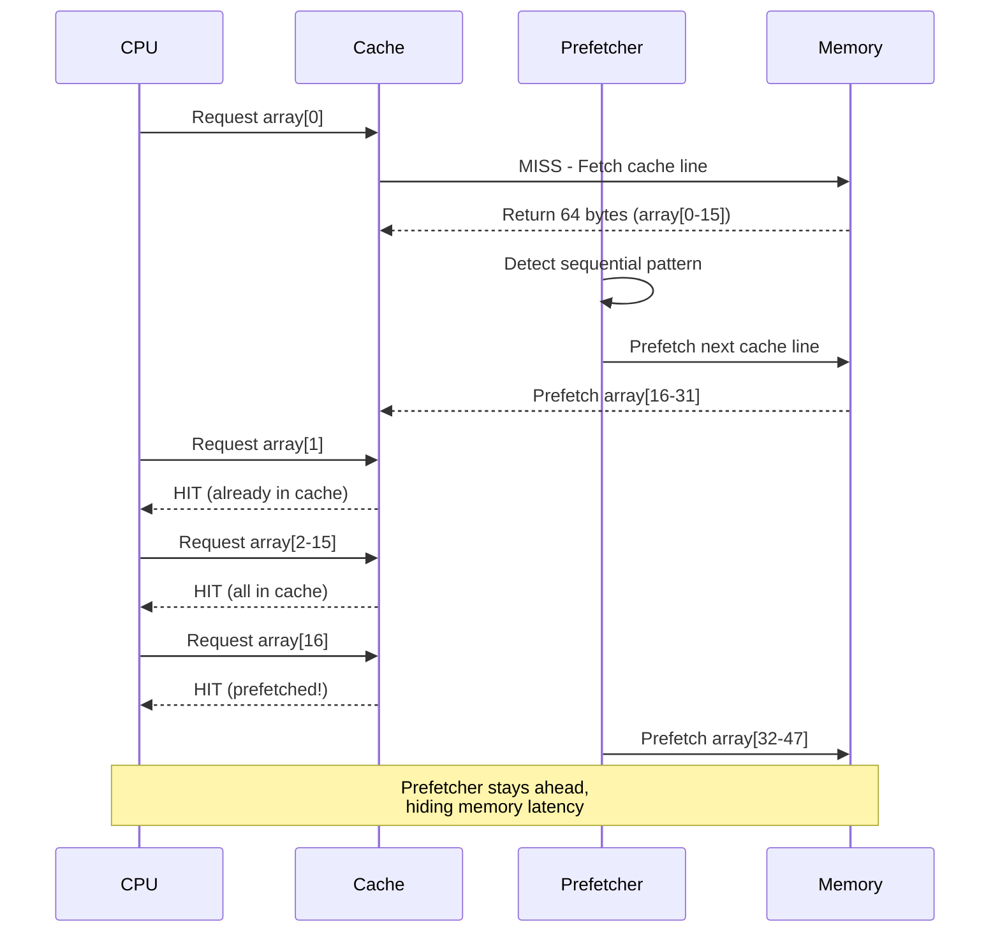
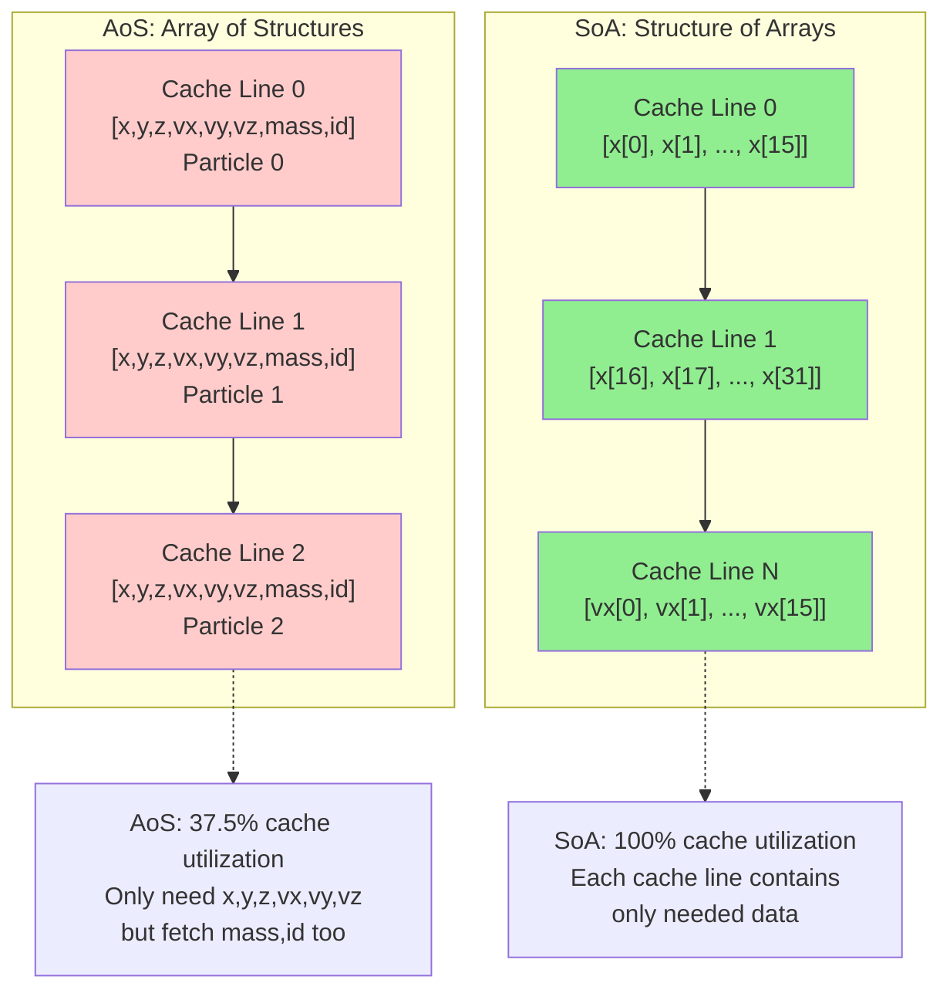

# Chapter 4: Arrays and Cache Locality

**Part II: Basic Data Structures**

---

> "The array is the most important data structure in computer science."
> — Donald Knuth (paraphrased)

## 最簡單的資料結構

Arrays 太簡單了，我們常常把它們視為理所當然。連續的記憶體、O(1) 存取，還有什麼好優化的？

一切。

我當時正在開發一個網路交換機的 packet processing pipeline。程式碼很直接：從 ring buffer（一個 array）讀取 packets、處理它們、然後把結果寫到另一個 array。很簡單，對吧？

性能糟透了。我們每秒處理 100,000 個 packets，但硬體應該能處理 1 million。

Profiler 顯示了一些奇怪的東西：

```bash
$ perf stat -e cache-misses,instructions ./packet_processor
  Performance counter stats:
    450,000 cache-misses
  1,000,000 instructions
```

1,000,000 個 instructions 有 450,000 個 cache misses？這表示每 2-3 個 instructions 就有一個 cache miss。對於簡單的 array 操作來說，這完全說不通。

問題不是 arrays 本身——而是**我們如何使用它們**。

## Memory Layout 很重要

讓我們從基礎開始。Array 是連續的記憶體：

```c
int array[8] = {0, 1, 2, 3, 4, 5, 6, 7};
```

在記憶體中（假設 4-byte integers）：

```
Address:  0x1000  0x1004  0x1008  0x100C  0x1010  0x1014  0x1018  0x101C
Value:    0       1       2       3       4       5       6       7
          └───────────────────────────────────────────────────────┘
                        One 64-byte cache line
```

**關鍵洞察**：所有 8 個 integers 都在同一個 64-byte cache line 裡。

**循序存取 array**：

```c
int sum = 0;
for (int i = 0; i < 8; i++) {
    sum += array[i];
}
```

**Cache 行為與 prefetching**：



**Cache 行為**：
- 第一次存取（`array[0]`）：**Cache miss**（100 cycles）
- 抓取整個 cache line（64 bytes = 16 個 integers）
- 接下來 7 次存取（`array[1]` 到 `array[7]`）：**Cache hits**（每次 1 cycle）
- **Prefetcher**：偵測到 pattern，提前抓取

**總成本**：100 + 7 = 107 cycles for 8 次存取 = **每次存取 13.4 cycles**

比較一下 random access：

```c
int indices[8] = {7, 2, 5, 0, 3, 6, 1, 4};
int sum = 0;
for (int i = 0; i < 8; i++) {
    sum += array[indices[i]];
}
```

如果 `indices` 導致存取不同的 cache lines：
- 每次存取：**Cache miss**（100 cycles）
- **總成本**：800 cycles for 8 次存取 = **每次存取 100 cycles**

**循序存取快 7.5 倍**，即使兩者都是 O(n)。

## Stride Patterns

不是所有的循序存取都一樣。**Stride** 很重要。

**Stride-1 access**（最佳情況）：

```c
for (int i = 0; i < n; i++) {
    sum += array[i];  // Stride = 1 element = 4 bytes
}
```

**Stride-2 access**（還不錯）：

```c
for (int i = 0; i < n; i += 2) {
    sum += array[i];  // Stride = 2 elements = 8 bytes
}
```

**Large stride**（更糟）：

```c
for (int i = 0; i < n; i += 16) {
    sum += array[i];  // Stride = 16 elements = 64 bytes
}
```

**為什麼 stride 很重要？**

1. **Cache line 利用率**：Stride-1 使用所有抓取的 64 bytes。Stride-16 每個 cache line 只用 4 bytes（6.25% 利用率）。

2. **Prefetcher 效能**：Hardware prefetchers 偵測 stride patterns，但大的 strides 可能超過 prefetch distance。

**Benchmark**（1M element array）：

```
Stride-1:   1.2 ms  (100% cache line utilization)
Stride-2:   1.3 ms  (50% utilization, still prefetched)
Stride-4:   1.5 ms  (25% utilization)
Stride-8:   2.1 ms  (12.5% utilization)
Stride-16:  3.8 ms  (6.25% utilization)
Stride-64:  8.5 ms  (1.56% utilization, new cache line each access)
```

**指導原則**：保持 stride 小（≤ 8 elements）以獲得好的性能。

### 真實世界工具：lmbench lat_mem_rd

經典的 `lmbench` benchmark suite 包含 `lat_mem_rd`，它測量不同 array sizes 和 strides 的 memory latency。這正是我們一直在討論的。

**運作方式**：

```c
// lmbench lat_mem_rd 的簡化版本
char *p = array;
for (int i = 0; i < iterations; i++) {
    // Pointer chasing with configurable stride
    p = *(char **)p;  // Follow pointer to next element
}
```

Array 被初始化，讓每個 element 指向距離 `stride` 的下一個 element：

```c
// Initialize array with stride
for (size_t i = 0; i < size; i += stride) {
    array[i] = &array[(i + stride) % size];
}
```

**執行 lmbench**：

```bash
$ lat_mem_rd 64M 128
# Array size: 64 MB, stride: 128 bytes

Output:
Stride  Latency
  128     3.2 ns   (L1 cache)
  256     3.5 ns   (L1 cache)
  512     4.1 ns   (L1 cache)
 1024     5.8 ns   (L2 cache)
 4096    12.5 ns   (L2 cache)
16384    45.0 ns   (L3 cache)
65536   102.0 ns   (DRAM)
```

**這顯示了什麼**：
- 小 strides（128-512 bytes）：留在 L1 cache（~3-4 ns）
- 中等 strides（1-4 KB）：L2 cache（~6-12 ns）
- 大 strides（16-64 KB）：L3 cache 或 DRAM（45-100+ ns）

**為什麼 stride 影響 latency**：
- **小 stride**：循序存取，prefetcher 有幫助，留在 L1
- **大 stride**：跳過 cache lines，破壞 prefetcher，從 L1 evict

**關鍵洞察**：這就是為什麼**資料結構 layout 很重要**。如果你的 struct 是 128 bytes，而你 iterate 一個 array of them，你在做 stride-128 存取。如果 struct 中只有 8 bytes 是「hot」（經常存取），你浪費了每個 cache line 的 93.75%。

**嵌入式觀點**：在沒有 L3 cache 的嵌入式系統上，latency cliff 更陡峭。一旦超過 L1/L2 容量，你直接到 DRAM 或 flash（慢 100-1000 倍）。

## Multi-Dimensional Arrays

Multi-dimensional arrays 引入了一個關鍵選擇：**row-major** vs **column-major** layout。

**C 使用 row-major order**：

```c
int matrix[4][4] = {
    {0,  1,  2,  3},
    {4,  5,  6,  7},
    {8,  9,  10, 11},
    {12, 13, 14, 15}
};
```

**Memory layout**（row-major）：

```
Address:  0x1000  0x1004  0x1008  0x100C  0x1010  0x1014  0x1018  0x101C  ...
Value:    0       1       2       3       4       5       6       7       ...
          └───────────── Row 0 ──────────┘└───────────── Row 1 ──────────┘
```

**Row-major traversal**（好）：

```c
for (int i = 0; i < 4; i++) {
    for (int j = 0; j < 4; j++) {
        sum += matrix[i][j];  // 在記憶體中是循序的
    }
}
```

**Column-major traversal**（壞）：

```c
for (int j = 0; j < 4; j++) {
    for (int i = 0; i < 4; i++) {
        sum += matrix[i][j];  // Stride = 4 elements = 16 bytes
    }
}
```

**Benchmark**（1024×1024 matrix）：

```
Row-major:     12 ms   (sequential access)
Column-major:  45 ms   (stride-1024 access)
```

**Column-major 慢 3.75 倍**，同樣的演算法！

## Matrix Multiplication 問題

Matrix multiplication 是 cache optimization 的經典範例：

```c
// Naive implementation
for (int i = 0; i < N; i++) {
    for (int j = 0; j < N; j++) {
        for (int k = 0; k < N; k++) {
            C[i][j] += A[i][k] * B[k][j];
        }
    }
}
```

**存取 patterns**：
- `A[i][k]`：Row-major，好（stride-1）
- `C[i][j]`：同一個 element 重複存取，極佳（temporal locality）
- `B[k][j]`：**Column-major，糟糕**（stride-N）

**對於 N=1024**：存取 `B[k][j]` 的 stride 是 1024 elements = 4096 bytes = 64 cache lines！

**解決方案 1**：Loop reordering（ikj order）

```c
// 更好：ikj order
for (int i = 0; i < N; i++) {
    for (int k = 0; k < N; k++) {
        int r = A[i][k];
        for (int j = 0; j < N; j++) {
            C[i][j] += r * B[k][j];  // 現在 B 是 row-major！
        }
    }
}
```

**現在的存取 patterns**：
- `A[i][k]`：Row-major，好
- `B[k][j]`：Row-major，好（原本是 column-major）
- `C[i][j]`：Row-major，好

**Benchmark**（512×512 matrices）：

```
ijk order (naive):  2,450 ms
ikj order:            680 ms   (3.6× faster)
```

**解決方案 2**：Blocking（tiling）

對於非常大的 matrices，無法放進 cache，使用 **blocking**：

```c
#define BLOCK_SIZE 64

for (int ii = 0; ii < N; ii += BLOCK_SIZE) {
    for (int jj = 0; jj < N; jj += BLOCK_SIZE) {
        for (int kk = 0; kk < N; kk += BLOCK_SIZE) {
            // 處理 BLOCK_SIZE × BLOCK_SIZE submatrix
            for (int i = ii; i < ii + BLOCK_SIZE && i < N; i++) {
                for (int k = kk; k < kk + BLOCK_SIZE && k < N; k++) {
                    int r = A[i][k];
                    for (int j = jj; j < jj + BLOCK_SIZE && j < N; j++) {
                        C[i][j] += r * B[k][j];
                    }
                }
            }
        }
    }
}
```

**為什麼 blocking 有效**：
- 處理能放進 L1 cache 的小 blocks
- 在 eviction 之前重複使用資料
- 大幅減少 cache misses

**Benchmark**（1024×1024 matrices）：

```
Naive (ijk):     18,500 ms
Reordered (ikj):  5,200 ms   (3.6× faster)
Blocked:          1,800 ms   (10.3× faster than naive, 2.9× faster than reordered)
```

## Structure of Arrays vs Array of Structures

你如何在 arrays 中組織資料有巨大的性能影響。

**Memory layout 比較**：



**Array of Structures (AoS)**：

```c
typedef struct {
    float x, y, z;    // Position (12 bytes)
    float vx, vy, vz; // Velocity (12 bytes)
    float mass;       // Mass (4 bytes)
    int id;           // ID (4 bytes)
} particle_t;        // Total: 32 bytes

particle_t particles[1000];

// 更新 positions
for (int i = 0; i < 1000; i++) {
    particles[i].x += particles[i].vx * dt;
    particles[i].y += particles[i].vy * dt;
    particles[i].z += particles[i].vz * dt;
}
```

**Memory layout**：

```
Cache line 0: [p0.x, p0.y, p0.z, p0.vx, p0.vy, p0.vz, p0.mass, p0.id]
Cache line 1: [p1.x, p1.y, p1.z, p1.vx, p1.vy, p1.vz, p1.mass, p1.id]
...
```

**問題**：每個 cache line 包含我們不需要的資料（`mass`、`id`）。我們只用了 64 bytes 中的 24 bytes（37.5% 利用率）。

**Structure of Arrays (SoA)**：

```c
typedef struct {
    float x[1000];
    float y[1000];
    float z[1000];
    float vx[1000];
    float vy[1000];
    float vz[1000];
    float mass[1000];
    int id[1000];
} particles_t;

particles_t particles;

// 更新 positions
for (int i = 0; i < 1000; i++) {
    particles.x[i] += particles.vx[i] * dt;
    particles.y[i] += particles.vy[i] * dt;
    particles.z[i] += particles.vz[i] * dt;
}
```

**Memory layout**：

```
Cache line 0: [x[0], x[1], x[2], ..., x[15]]
Cache line 1: [x[16], x[17], ..., x[31]]
...
```

**優勢**：100% cache line 利用率。每個 cache line 只包含我們需要的資料。

**Benchmark**（1M particles，1000 iterations）：

```
AoS:  2,850 ms
SoA:  1,200 ms   (2.4× faster)
```

**何時使用 SoA**：
- 操作只存取少數 fields
- 大 arrays（> cache size）
- 性能關鍵的 loops

**何時使用 AoS**：
- 操作存取所有 fields
- 小 arrays（< cache size）
- 程式碼清晰度比性能更重要

## Alignment 和 Padding

Memory alignment 影響正確性和性能。

**Natural alignment**：
- `char`: 1-byte aligned
- `short`: 2-byte aligned
- `int`: 4-byte aligned
- `long`: 8-byte aligned
- `double`: 8-byte aligned

**Unaligned access**：

```c
char buffer[16];
int *p = (int*)(buffer + 1);  // Unaligned！
*p = 42;  // 可能很慢或 crash
```

**在 x86 上**：Unaligned access 可以運作但較慢（可能跨越 cache line boundary）
**在 ARM/RISC-V 上**：可能 trap 或需要多次存取

**Structure padding**：

```c
struct bad {
    char a;    // 1 byte
    int b;     // 4 bytes, needs 4-byte alignment
    char c;    // 1 byte
};  // Size: 12 bytes (with padding)
```

**Memory layout**：

```
Offset:  0    1    2    3    4    5    6    7    8    9    10   11
Value:   a    pad  pad  pad  b    b    b    b    c    pad  pad  pad
```

**更好的排序**：

```c
struct good {
    int b;     // 4 bytes
    char a;    // 1 byte
    char c;    // 1 byte
};  // Size: 8 bytes (with padding)
```

**Memory layout**：

```
Offset:  0    1    2    3    4    5    6    7
Value:   b    b    b    b    a    c    pad  pad
```

**指導原則**：將 struct members 從最大到最小排序，以最小化 padding。

**Cache line alignment**：

對於性能關鍵的 structures，align 到 cache line boundaries：

```c
struct __attribute__((aligned(64))) cache_aligned {
    int data[16];
};
```

**為什麼？**
- 防止 multi-core 上的 false sharing
- 確保 structure 不會跨越 cache lines
- 可預測的 cache 行為

## Array Bounds 和 Prefetching

現代 CPUs prefetch 資料，但它們無法 prefetch 超過它們不知道的 array bounds。

**幫助 prefetcher**：

```c
// 不好：不可預測的 loop bound
for (int i = 0; i < get_count(); i++) {
    sum += array[i];
}

// 好：常數 loop bound
int n = get_count();
for (int i = 0; i < n; i++) {
    sum += array[i];
}

// 更好：Compiler 可以看到 bound
#define SIZE 1000
for (int i = 0; i < SIZE; i++) {
    sum += array[i];
}
```

**Loop unrolling** 幫助 prefetching：

```c
// 手動 unrolling
for (int i = 0; i < n; i += 4) {
    sum += array[i];
    sum += array[i+1];
    sum += array[i+2];
    sum += array[i+3];
}
```

**好處**：
- 減少 loop overhead
- 暴露更多 parallelism
- 幫助 prefetcher 看到 pattern

**Compiler 可以 auto-unroll**：

```c
#pragma GCC unroll 4
for (int i = 0; i < n; i++) {
    sum += array[i];
}
```

## 嵌入式系統：小 Arrays，大影響

在有小 caches（8-32 KB）的嵌入式系統上，array optimization 更加關鍵。

**範例**：RISC-V MCU with 16 KB L1 cache

```c
// 這個 array 是你整個 cache 的 40%！
int buffer[1000];  // 4 KB
```

**嵌入式指導原則**：

**1. 保持 arrays 小**

```c
// 不好：浪費 cache
int large_buffer[10000];  // 40 KB, doesn't fit in cache

// 好：放得進 cache
int small_buffer[1000];   // 4 KB, fits comfortably
```

**2. 重複使用 arrays**

```c
// 不好：多個 arrays 競爭 cache
int input[1000];
int temp[1000];
int output[1000];

// 好：重複使用同一個 buffer
int buffer[1000];
process_in_place(buffer);
```

**3. 使用更小的 types**

```c
// 不好：浪費記憶體和 cache
int32_t values[1000];  // 4 KB

// 好：如果範圍允許
int16_t values[1000];  // 2 KB, 2× more data in cache
```

**4. Pack data**

```c
// 不好：每個 flag 4 bytes
int flags[1000];  // 4 KB

// 好：每個 flag 1 bit
uint32_t flags[32];  // 128 bytes, 32× smaller!

void set_flag(int i) {
    flags[i / 32] |= (1 << (i % 32));
}

int get_flag(int i) {
    return (flags[i / 32] >> (i % 32)) & 1;
}
```

## 真實案例：Packet Buffer

回到我的 packet processing 問題。這是錯誤的地方：

**原始程式碼**（壞）：

```c
typedef struct {
    uint8_t data[1500];     // Packet data
    uint32_t length;        // Packet length
    uint32_t timestamp;     // Timestamp
    uint32_t src_ip;        // Source IP
    uint32_t dst_ip;        // Dest IP
    uint16_t src_port;      // Source port
    uint16_t dst_port;      // Dest port
    uint8_t protocol;       // Protocol
    uint8_t flags;          // Flags
} packet_t;  // Total: ~1520 bytes

packet_t packets[1000];  // 1.52 MB

// 處理 packets
for (int i = 0; i < count; i++) {
    if (packets[i].protocol == TCP) {
        process_tcp(&packets[i]);
    }
}
```

**問題**：每次 iteration 抓取 1520 bytes（24 cache lines）只是為了檢查 `protocol`（1 byte）。

**修正後的程式碼**（好）：

```c
// 分離 hot 和 cold data
typedef struct {
    uint8_t protocol;       // Hot: 每次 iteration 都檢查
    uint8_t flags;          // Hot: 經常檢查
    uint16_t length;        // Hot: 用於處理
    uint32_t data_offset;   // Offset into data array
} packet_header_t;  // 8 bytes

packet_header_t headers[1000];  // 8 KB
uint8_t packet_data[1500 * 1000];  // 1.5 MB

// 處理 packets
for (int i = 0; i < count; i++) {
    if (headers[i].protocol == TCP) {
        uint8_t *data = &packet_data[headers[i].data_offset];
        process_tcp(&headers[i], data);
    }
}
```

**結果**：
- Headers 放得進 cache（8 KB vs 1.52 MB）
- 第一個 loop：cache lines 少 8 倍
- 只在需要時才抓取 packet data
- **性能**：100K → 950K packets/sec（快 9.5 倍）

---

## Summary

Packet processing pipeline 的糟糕性能——每秒 100,000 個 packets 而不是 1 million——透過理解 array access patterns 修正了。450,000 個 cache misses 來自差的 memory layout 和 access order。重組為 Structure of Arrays 並優化 traversal order 讓性能達到每秒 950,000 個 packets，快了將近 10 倍。

Arrays 看起來很簡單——連續記憶體、O(1) access——但硬體現實讓它們變得複雜。Memory layout 很重要。Access patterns 很重要。Stride 很重要。Alignment 很重要。Cache line 利用率很重要。

Sequential access 比 random access 快 7-10 倍，即使兩者都是 O(n)。小 strides（stride-1、stride-2）比大 strides（stride-64）快 7 倍。Row-major traversal 比 column-major traversal 快 3.75 倍。Structure of Arrays 比 Array of Structures 快 2.4 倍，當你只存取少數 fields 時。Blocking/tiling 讓 matrix multiplication 快 10 倍。分離 hot 和 cold data 讓 packet processing 快 9.5 倍。

關鍵原則：sequential access 勝過 random、小 strides 勝過大 strides、C arrays 用 row-major traversal、selective field access 用 SoA 勝過 AoS、alignment 很重要（正確性和性能）、保持 working set 在 cache 中。

優化技術：loop reordering（ikj vs ijk）、大 arrays 用 blocking/tiling、Structure of Arrays (SoA)、適當的 alignment 和 padding、loop unrolling、lmbench lat_mem_rd 用於測量 memory latency。

嵌入式考量：保持 arrays 小（放得進 cache）、重複使用 buffers、使用更小的 types、pack data（bit arrays）、分離 hot/cold data。在 16 KB L1 cache 上，一個 4 KB array 是你整個 cache 的 40%。

測量：優化前先 profile、測量 cache misses、在目標硬體上測試。Profiler 顯示 450,000 cache misses for 1,000,000 instructions——每 2-3 個 instructions 一個 miss。這不正常。修正後：cache miss rate 降到 < 5%。

下一章：我們看到了為什麼 arrays 快。現在讓我們探討為什麼 linked lists 慢——以及何時你應該還是要用它們。

