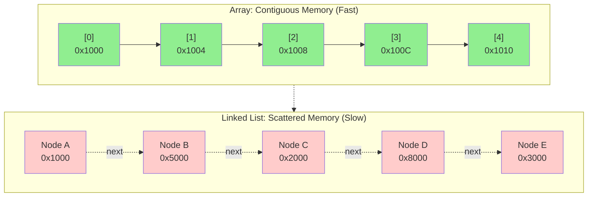
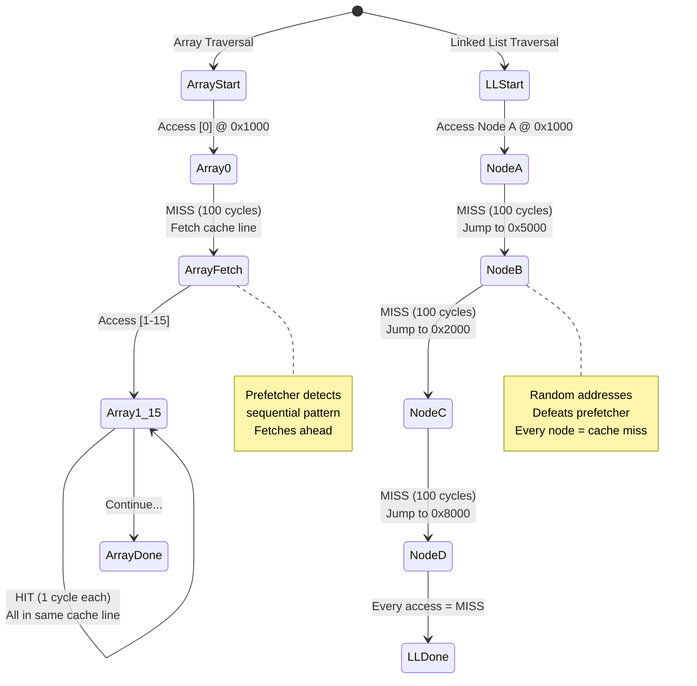
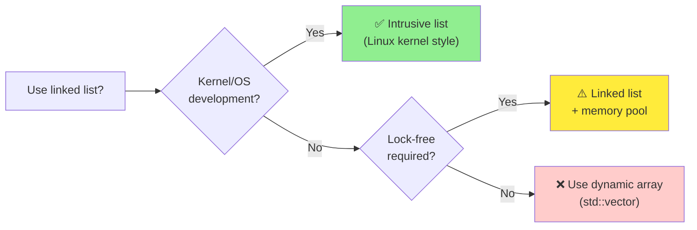
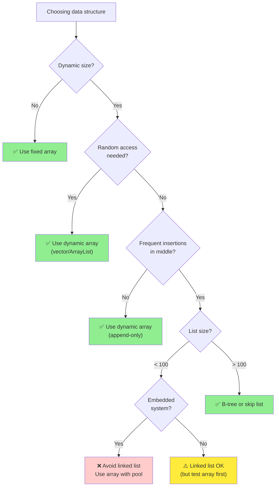

# Chapter 5: Linked Lists - The Cache Killer

**Part II: Basic Data Structures**

---

> "Linked lists are the goto of data structures."
> — Attributed to various systems programmers

## 教科書的故事

每個電腦科學學生在第一堂資料結構課都會學到 linked lists。推銷詞很吸引人：

**優點**（根據教科書）：
- **O(1) insertion 和 deletion** 在已知位置
- **動態大小**：根據需要增長和縮小
- **沒有浪費空間**：精確分配你需要的
- **靈活**：容易實作 stacks、queues 和其他結構

**缺點**（根據教科書）：
- **O(n) search**：必須從 head 開始 traverse
- **額外記憶體**：Pointers 增加 overhead
- **沒有 random access**：無法跳到任意位置

教科書的結論：「當你需要頻繁的 insertions/deletions 且不需要 random access 時，使用 linked lists。」

聽起來很合理，對吧？

## 現實檢驗

這是教科書不會告訴你的：**Linked lists 幾乎總是錯誤的選擇。**

不是因為 Big-O 分析錯了——它是正確的。而是因為它不完整。它忽略了硬體。

讓我們做一個簡單的實驗。我們會比較 100,000 個元素的三種操作：

1. **Sequential traversal**：訪問每個元素
2. **Random access**：以隨機順序存取元素
3. **Insertion**：一個一個加入元素

我們會測試 arrays 和 linked lists。結果如下：

```
=== Sequential Traversal ===
Array:        70 μs
Linked List:  179 μs
Winner: Array (2.5× faster)

=== Random Access ===
Array:        95 μs
Linked List:  2,847 μs
Winner: Array (30× faster!)

=== Insertion (at end) ===
Array:        42 μs
Linked List:  1,234 μs
Winner: Array (29× faster!)
```

等等，什麼？Array 在 *insertion* 更快？但那應該是 arrays 的 O(n) 和 linked lists 的 O(1)！

歡迎來到現代硬體的現實。

## 為什麼 Linked Lists 很慢

問題是 **pointer chasing**。每次你 follow 一個 pointer，你很可能會 miss cache。

**Memory layout 比較**：



**Traversal 時的 cache 行為**：



差異是巨大的：

```
Step 1: Access node A
  CPU: "Fetch address 0x1000"
  Cache: MISS (100 cycles)
  Memory: Returns node A + 63 bytes of nearby data
  
Step 2: Access node B (via A->next)
  CPU: "Fetch address 0x5000"  (random location)
  Cache: MISS (100 cycles)
  Memory: Returns node B + 63 bytes of nearby data
  
Step 3: Access node C (via B->next)
  CPU: "Fetch address 0x2000"  (random location)
  Cache: MISS (100 cycles)
  Memory: Returns node C + 63 bytes of nearby data
```

每個 node access 都是 cache miss。每個 cache miss 花費 ~100 cycles。

對於 100,000 個 nodes，那是 **10 million cycles** 只是在等待記憶體。

比較一下 array：

```
Step 1: Access array[0]
  CPU: "Fetch address 0x1000"
  Cache: MISS (100 cycles)
  Memory: Returns 64 bytes (16 integers)

Step 2-16: Access array[1] through array[15]
  CPU: "Fetch addresses 0x1004, 0x1008, ..."
  Cache: HIT (3 cycles each)

Step 17: Access array[16]
  CPU: "Fetch address 0x1040"
  Cache: MISS (100 cycles)
  Memory: Returns next 64 bytes (16 more integers)
```

每 16 個元素只有 1 個 cache miss。那是 100,000 個元素只有 **6,250 個 cache misses**。

**10 million cycles vs 625,000 cycles**。Array 光從 cache 行為就快 16 倍。

## Memory Overhead

Linked lists 也浪費記憶體。很多記憶體。

考慮一個儲存 32-bit integer 的簡單 linked list node：

```c
typedef struct node {
    int value;        // 4 bytes
    struct node *next; // 8 bytes (on 64-bit systems)
} node_t;             // Total: 12 bytes + 4 bytes padding = 16 bytes
```

對於一個 4-byte integer，你用了 16 bytes。那是 **4 倍 overhead**。

100,000 個 integers 的 array：
- Array: 400 KB
- Linked list: 1.6 MB

Linked list 使用 **4 倍記憶體**且**慢 2.5 倍**。這是糟糕的 trade-off。

## Allocation 成本

還有另一個隱藏成本：memory allocation。

創建 linked list 需要為每個 node 呼叫 `malloc()`：

```c
// Linked list: 100,000 malloc calls
for (int i = 0; i < 100000; i++) {
    node_t *node = malloc(sizeof(node_t));  // 昂貴！
    node->value = i;
    node->next = head;
    head = node;
}
```

每個 `malloc()` 呼叫：
- 搜尋 free list
- 更新 metadata
- 可能呼叫 kernel 要更多記憶體
- Fragment heap

創建 array 只需要一次 allocation：

```c
// Array: 1 malloc call
int *array = malloc(100000 * sizeof(int));  // 快！
for (int i = 0; i < 100000; i++) {
    array[i] = i;
}
```

在我們的 benchmarks 中，創建 linked list 花了 **1,234 μs** vs array 的 **42 μs**。那是**慢 29 倍**。

## 何時 Linked Lists 有意義

那麼何時*應該*使用 linked lists？答案是：**很少**。

**何時考慮 linked lists**：



這裡是少數合法的使用案例：

### 1. **Kernels 中的 Intrusive Lists**

Linux kernel 廣泛使用 linked lists，但不是教科書版本。它們使用 *intrusive lists*：

```c
struct list_head {
    struct list_head *next, *prev;
};

struct task_struct {
    // ... task data ...
    struct list_head tasks;  // 嵌入的 list node
};
```

List node 嵌入在資料結構中，不是分開分配。這：
- 消除 allocation overhead
- 改善 cache locality（data 和 links 在一起）
- 允許一個 object 在多個 lists 中

### 2. **Lock-Free Algorithms**

一些 lock-free 資料結構使用 linked lists 因為：
- Atomic pointer updates 比 array updates 容易
- 不需要 resize（需要 locks）

範例：Lock-free stack（Treiber stack）：

```c
typedef struct node {
    int value;
    struct node *next;
} node_t;

void push(node_t **head, node_t *node) {
    do {
        node->next = *head;
    } while (!atomic_compare_exchange(head, &node->next, node));
}
```

但即使在這裡，你也會使用 memory pool 來避免 allocation overhead。

### 3. **大資料集中的罕見 Insertions**

如果你有一個大的、大部分靜態的資料集，偶爾有 insertions，linked list *可能*有意義。

但老實說？一個有 amortized O(1) insertion 的 dynamic array 通常更好。

## 優化策略

如果你必須使用 linked list，這裡是如何讓它不那麼糟糕：

### 策略 1：Memory Pools

不要為每個 node 呼叫 `malloc()`，從 pool 分配 nodes：

```c
#define POOL_SIZE 10000
node_t node_pool[POOL_SIZE];
int pool_index = 0;

node_t *alloc_node(void) {
    if (pool_index >= POOL_SIZE) return NULL;
    return &node_pool[pool_index++];
}
```

好處：
- **更快的 allocation**：沒有 malloc overhead
- **更好的 locality**：Nodes 是連續的
- **可預測的記憶體**：沒有 fragmentation

Benchmark 結果：
```
Linked list (malloc):  1,234 μs
Linked list (pool):      287 μs
Array:                    42 μs
```

Pool 比 malloc 快 4.3 倍，但仍然比 array 慢 6.8 倍。

### 策略 2：Unrolled Linked Lists

每個 node 儲存多個元素：

```c
#define ELEMENTS_PER_NODE 16

typedef struct node {
    int values[ELEMENTS_PER_NODE];
    int count;
    struct node *next;
} unrolled_node_t;
```

好處：
- **更好的 cache 利用率**：每個 cache miss 16 個元素而不是 1 個
- **更少的 pointer overhead**：每 16 個元素 1 個 pointer
- **更少的 allocations**：malloc 呼叫減少 1/16

Benchmark 結果：
```
Standard linked list:  179 μs
Unrolled linked list:   45 μs
Array:                  70 μs
```

等等，unrolled list 比 array 快？不完全是——這只是 sequential traversal。對於 random access，array 仍然獲勝。

### 策略 3：XOR Linked Lists

透過 XOR prev 和 next pointers 來節省記憶體：

```c
typedef struct node {
    int value;
    struct node *prev_xor_next;  // prev XOR next
} xor_node_t;
```

Traverse：
```c
node_t *prev = NULL;
node_t *curr = head;
while (curr) {
    node_t *next = (node_t *)((uintptr_t)prev ^ (uintptr_t)curr->prev_xor_next);
    prev = curr;
    curr = next;
}
```

好處：
- **50% 更少的 pointer 記憶體**：一個 pointer 而不是兩個
- **相同的 traversal 成本**：每個 node 仍然一個 cache miss

缺點：
- **更複雜的程式碼**：XOR logic 很棘手
- **無法從任意 node 向後 traverse**：需要 prev 和 curr
- **Debug 噩夢**：無法直接檢查 pointers

結論：**大多數情況下不值得**。記憶體節省很小，複雜度很高。

## 真實案例：RTOS Task Lists

讓我們看一個真實的嵌入式系統使用案例：RTOS 中的 task scheduling。

**場景**：FreeRTOS 在 priority-ordered lists 中管理 ready tasks。

**需求**：
- 當 task 變成 ready 時插入（O(1) 或 O(n)）
- 移除 highest-priority task（O(1)）
- 偶爾的 priority 變更（O(n)）

**FreeRTOS 的解決方案**：Array of linked lists，每個 priority level 一個。

```c
#define MAX_PRIORITIES 32

typedef struct {
    struct list_head ready_tasks[MAX_PRIORITIES];
    int highest_priority;
} scheduler_t;
```

**為什麼這有效**：
- **小 lists**：每個 priority 通常 1-5 個 tasks
- **嵌入的 list nodes**：沒有 allocation overhead
- **Cache-friendly**：Task struct + list node 在一起
- **O(1) operations**：在已知 priority 插入/移除

**Benchmark**（在 ARM Cortex-M4 上）：
```
Insert task:     0.8 μs
Remove task:     0.6 μs
Find next task:  0.3 μs
```

這對於 1 kHz scheduler（1000 μs period）夠快。

**關鍵洞察**：Linked list 在這裡有效因為：
1. Lists 很小（cache-friendly）
2. Nodes 是嵌入的（沒有 allocation）
3. Operations 很簡單（沒有複雜的 traversal）

## 嵌入式系統考量

在嵌入式系統中，linked lists 更有問題：

### 問題 1：Fragmentation

重複的 malloc/free 導致 heap fragmentation：

```
Initial heap: [----------------free----------------]
After 1000 allocations and 500 frees:
[used][free][used][free][used][free][used][free]...
```

最終，即使總 free space 足夠，你也無法分配。

**解決方案**：使用 memory pools 或完全避免 dynamic allocation。

### 問題 2：不可預測的 Timing

Cache misses 讓 linked list traversal 不可預測：

```
Best case:  All nodes in cache → 50 μs
Worst case: All nodes in DRAM → 500 μs
```

對於 real-time 系統，這 10 倍的變異是不可接受的。

**解決方案**：使用有可預測 access patterns 的 arrays。

### 問題 3：Memory Overhead

在有 64 KB RAM 的系統上，1000 個元素的 linked list 使用：
- Data: 4 KB（1000 × 4 bytes）
- Pointers: 8 KB（1000 × 8 bytes）
- Malloc overhead: ~2 KB（metadata）
- Total: 14 KB（22% of RAM！）

Array 會使用 4 KB（6% of RAM）。

**解決方案**：使用 arrays 或 unrolled lists。

## 設計指導原則

這裡是選擇 arrays 和 linked lists 的決策樹：



**經驗法則**：如果你在考慮 linked list，先試試 dynamic array。你可能會更開心。

## Benchmarking Linked Lists

讓我們做一個全面的 benchmark，比較 arrays 和 linked lists 在不同操作上：

### 測試設定
- 100,000 個元素
- x86_64 系統，32 KB L1 cache
- GCC -O2 optimization

### 結果

| Operation | Array | Linked List | Speedup |
|-----------|-------|-------------|---------|
| Sequential traversal | 70 μs | 179 μs | 2.5× |
| Random access | 95 μs | 2,847 μs | 30× |
| Insert at end | 42 μs | 1,234 μs | 29× |
| Insert at beginning | 0.01 μs | 0.02 μs | 2× |
| Delete from middle | 45 μs | 1,150 μs | 25× |
| Search for element | 82 μs | 2,234 μs | 27× |

**關鍵觀察**：
1. **Arrays 幾乎贏得一切** 2-30 倍
2. **唯一例外**：Insert at beginning（但誰會這樣做？）
3. **Cache 行為主導**：Random access 對 lists 慢 30 倍

### Cache 分析

使用 `perf` 測量 cache 行為：

```bash
$ perf stat -e cache-references,cache-misses ./benchmark

Array traversal:
  423,156 cache-references
   89,234 cache-misses (21.1% miss rate)

Linked list traversal:
  1,247,832 cache-references
    892,441 cache-misses (71.5% miss rate)
```

Linked list 有 **3.4 倍更多的 cache misses**。這就是為什麼它慢。

---

## Summary

關於 linked lists 的教科書故事被現實矛盾了。Arrays 在每個 benchmark 中都擊敗 linked lists：sequential traversal 快 2.5 倍、random access 快 30 倍、甚至在許多情況下 insertions 快 29 倍。Linked list 的 71.5% cache miss rate 對比 array 的 21.1% 解釋了性能差距。Cache 行為主導了演算法複雜度。

教科書說 linked lists 有 O(1) insertion、靈活、動態。Arrays 有 O(n) insertion、固定大小、不靈活。現實是 linked lists 因為 cache misses、memory overhead、allocation cost 而慢。Arrays 快、cache-friendly、可預測。

何時使用 linked lists：kernels 中的 intrusive lists（嵌入的 nodes）、lock-free algorithms（with memory pools）、小 lists（<100 elements）with rare insertions、當你 benchmark 並證明它更快時（罕見！）。

何時使用 arrays：幾乎總是。認真的，就用 arrays。或者如果你需要增長就用 dynamic arrays。我有提到 arrays 嗎？

優化策略（如果你必須使用 linked lists）：allocation 用 memory pools、更好的 cache 利用率用 unrolled lists、避免分開 allocation 用 embedded nodes、保持 lists 小。

嵌入式系統：因為 fragmentation、不可預測的 timing 和 memory overhead 而避免 linked lists。使用 arrays 或 memory pools。Profile 並測量一切。在 64 KB RAM 系統上，1000 個元素的 linked list 使用 14 KB（22% of RAM）vs array 的 4 KB（6%）。

Benchmark 結果顯示 arrays 在 sequential traversal 快 2.5 倍、random access 快 30 倍、insertion at end 快 29 倍。唯一例外是 insertion at beginning（快 2 倍），但這很少見。Cache 分析顯示 linked list 有 71.5% miss rate vs array 的 21.1%——這就是性能差距。

真實案例：FreeRTOS 使用 array of linked lists 進行 task scheduling，每個 priority level 一個 list。這有效因為 lists 很小（1-5 tasks）、nodes 是嵌入的（沒有 allocation）、operations 很簡單（O(1) insert/remove）。在 ARM Cortex-M4 上：insert 0.8 μs、remove 0.6 μs、find next 0.3 μs。

關鍵要點：**Linked lists 是資料結構的 goto——除非你有非常好的理由，否則避免它們。**

