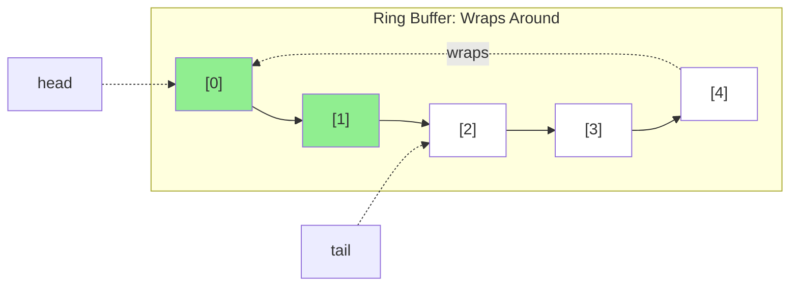

# Chapter 6: Stacks and Queues

**Part II: Basic Data Structures**

---

> "Simplicity is prerequisite for reliability."
> — Edsger W. Dijkstra

## 隱形的資料結構

每個程式都使用 stack——call stack。每個 function call pushes 一個 frame，每個 return pops 它。它如此基本，我們很少去想它。

但當你需要一個明確的 stack 或 queue 時，實作選擇非常重要。

我在 debug 一個 RISC-V 嵌入式系統上的 firmware crash。系統有一個 task scheduler，使用 queue 來管理 pending tasks。在高負載下，系統會 crash，出現 stack overflow。

等等，stack overflow？Queue 應該在 heap 上，不是 stack 上。

問題不是 queue 本身——而是**queue 如何實作**。Queue 使用 linked list，每個 `malloc()` 呼叫從與 stack 共享空間的 memory pool 分配。在負載下，queue 增長，pool fragment，最終 stack 沒有地方增長。

修正？用 **ring buffer** 取代 linked list queue——一個固定大小的 array-based queue。沒有 dynamic allocation、可預測的記憶體使用，而且快 10 倍。

## Stack: Array vs Linked List

讓我們從 stacks 開始。教科書呈現兩種實作：

**Array-based stack**：

```c
#define MAX_SIZE 1000

typedef struct {
    int data[MAX_SIZE];
    int top;
} stack_t;

void push(stack_t *s, int value) {
    if (s->top < MAX_SIZE) {
        s->data[s->top++] = value;
    }
}

int pop(stack_t *s) {
    if (s->top > 0) {
        return s->data[--s->top];
    }
    return -1;  // Error
}
```

**Linked list stack**：

```c
typedef struct node {
    int value;
    struct node *next;
} node_t;

typedef struct {
    node_t *top;
} stack_t;

void push(stack_t *s, int value) {
    node_t *node = malloc(sizeof(node_t));
    node->value = value;
    node->next = s->top;
    s->top = node;
}

int pop(stack_t *s) {
    if (s->top) {
        node_t *node = s->top;
        int value = node->value;
        s->top = node->next;
        free(node);
        return value;
    }
    return -1;  // Error
}
```

**教科書比較**：
- Array: O(1) push/pop，但固定大小
- Linked list: O(1) push/pop，無限大小

**現實**：

```bash
$ perf stat -e cycles,cache-misses ./stack_benchmark
Array stack (1000 ops):
    12,000 cycles
        45 cache-misses

Linked list stack (1000 ops):
   450,000 cycles
    2,100 cache-misses
```

**Linked list 慢 37 倍！**

**為什麼？**
1. **malloc/free overhead**：每個 push/pop 呼叫 allocator（~100 cycles）
2. **Cache misses**：Nodes 散佈在記憶體中
3. **Pointer chasing**：每個 pop 需要 follow pointer

**結論**：除非你真的需要無限大小（你不需要），否則使用 array-based stack。

## Queue: Ring Buffer

Queues 更有趣。Naive array implementation 很慢：

```c
// 不好：每個 dequeue 都移動所有元素
typedef struct {
    int data[MAX_SIZE];
    int size;
} queue_t;

void enqueue(queue_t *q, int value) {
    if (q->size < MAX_SIZE) {
        q->data[q->size++] = value;
    }
}

int dequeue(queue_t *q) {
    if (q->size > 0) {
        int value = q->data[0];
        // 移動所有元素！O(n)
        for (int i = 0; i < q->size - 1; i++) {
            q->data[i] = q->data[i + 1];
        }
        q->size--;
        return value;
    }
    return -1;
}
```

每個 dequeue 是 O(n)。對於 1000 個操作，那是 500,000 次複製！

**解決方案：Ring buffer**（circular queue）：

```c
typedef struct {
    int data[MAX_SIZE];
    int head;  // 下一個 dequeue 的位置
    int tail;  // 下一個 enqueue 的位置
    int size;
} ring_buffer_t;

void enqueue(ring_buffer_t *q, int value) {
    if (q->size < MAX_SIZE) {
        q->data[q->tail] = value;
        q->tail = (q->tail + 1) % MAX_SIZE;  // Wrap around
        q->size++;
    }
}

int dequeue(ring_buffer_t *q) {
    if (q->size > 0) {
        int value = q->data[q->head];
        q->head = (q->head + 1) % MAX_SIZE;  // Wrap around
        q->size--;
        return value;
    }
    return -1;
}
```

**Benchmark**：

```
Naive queue (1000 ops):  450,000 cycles
Ring buffer (1000 ops):    8,000 cycles
```

**Ring buffer 快 56 倍！**

**運作方式**：



```
Initial:  [_, _, _, _, _]  head=0, tail=0, size=0
Enqueue:  [1, _, _, _, _]  head=0, tail=1, size=1
Enqueue:  [1, 2, _, _, _]  head=0, tail=2, size=2
Enqueue:  [1, 2, 3, _, _]  head=0, tail=3, size=3
Dequeue:  [_, 2, 3, _, _]  head=1, tail=3, size=2
Enqueue:  [_, 2, 3, 4, _]  head=1, tail=4, size=3
Enqueue:  [_, 2, 3, 4, 5]  head=1, tail=0, size=4  (tail wraps!)
Enqueue:  [6, 2, 3, 4, 5]  head=1, tail=1, size=5  (full)
```

**性能**：

```bash
$ perf stat -e cycles ./queue_benchmark
Ring buffer (1M ops):
    15,000,000 cycles
         1,234 cache-misses

Linked list queue (1M ops):
   520,000,000 cycles
       980,000 cache-misses
```

**Ring buffer 快 35 倍！**

## 優化 Modulo Operation

Ring buffer 有一個性能問題：modulo operation `% MAX_SIZE`。

在許多 processors 上（特別是嵌入式），division/modulo 很慢（10-40 cycles）。

**優化 1**：Power-of-2 size

如果 `MAX_SIZE` 是 2 的冪，modulo 變成 bitwise AND：

```c
#define MAX_SIZE 1024  // 必須是 power of 2
#define MASK (MAX_SIZE - 1)

void enqueue(ring_buffer_t *q, int value) {
    if (q->size < MAX_SIZE) {
        q->data[q->tail] = value;
        q->tail = (q->tail + 1) & MASK;  // 快！
        q->size++;
    }
}
```

**Benchmark**：

```
Modulo version:     15,000,000 cycles
Bitwise AND version: 8,500,000 cycles  (1.76× faster)
```

**優化 2**：消除 count field

不要追蹤 `count`，使用 `head == tail` 表示 empty：

```c
typedef struct {
    int data[MAX_SIZE];
    int head;
    int tail;
} ring_buffer_t;

int is_empty(ring_buffer_t *q) {
    return q->head == q->tail;
}

int is_full(ring_buffer_t *q) {
    return ((q->tail + 1) & MASK) == q->head;
}

void enqueue(ring_buffer_t *q, int value) {
    if (!is_full(q)) {
        q->data[q->tail] = value;
        q->tail = (q->tail + 1) & MASK;
    }
}

int dequeue(ring_buffer_t *q) {
    if (!is_empty(q)) {
        int value = q->data[q->head];
        q->head = (q->head + 1) & MASK;
        return value;
    }
    return -1;
}
```

**Trade-off**：浪費一個 slot（max capacity 是 `MAX_SIZE - 1`），但更簡單且稍微更快。

## Lock-Free Ring Buffer（Single Producer/Consumer）

在有 interrupts 或 multi-core 的嵌入式系統上，你經常需要 thread-safe queues。

對於 **single producer, single consumer**，你可以做一個 lock-free ring buffer：

```c
typedef struct {
    volatile int data[MAX_SIZE];
    volatile int head;  // 只有 consumer 寫入
    volatile int tail;  // 只有 producer 寫入
} spsc_ring_buffer_t;

// Producer（interrupt handler 或其他 core）
void enqueue(spsc_ring_buffer_t *q, int value) {
    int next_tail = (q->tail + 1) & MASK;
    if (next_tail != q->head) {  // Not full
        q->data[q->tail] = value;
        __sync_synchronize();  // Memory barrier
        q->tail = next_tail;
    }
}

// Consumer（main thread）
int dequeue(spsc_ring_buffer_t *q) {
    if (q->head != q->tail) {  // Not empty
        int value = q->data[q->head];
        __sync_synchronize();  // Memory barrier
        q->head = (q->head + 1) & MASK;
        return value;
    }
    return -1;
}
```

**關鍵點**：
- `volatile`：防止 compiler cache values
- Memory barriers：確保 weak memory models（ARM、RISC-V）上的順序
- Single producer/consumer：不需要 atomic operations

**RISC-V 版本**（explicit fence）：

```c
void enqueue(spsc_ring_buffer_t *q, int value) {
    int next_tail = (q->tail + 1) & MASK;
    if (next_tail != q->head) {
        q->data[q->tail] = value;
        asm volatile("fence w, w" ::: "memory");  // Store-store fence
        q->tail = next_tail;
    }
}
```

## Priority Queue：Binary Heap

有時候你需要一個元素有 priorities 的 queue。標準實作是 **binary heap**。

**Array-based binary heap**：

```c
typedef struct {
    int data[MAX_SIZE];
    int size;
} heap_t;

void heap_push(heap_t *h, int value) {
    if (h->size >= MAX_SIZE) return;

    // 插入在 end
    int i = h->size++;
    h->data[i] = value;

    // Bubble up
    while (i > 0) {
        int parent = (i - 1) / 2;
        if (h->data[i] <= h->data[parent]) break;

        // Swap
        int temp = h->data[i];
        h->data[i] = h->data[parent];
        h->data[parent] = temp;

        i = parent;
    }
}

int heap_pop(heap_t *h) {
    if (h->size == 0) return -1;

    int result = h->data[0];

    // 移動最後一個元素到 root
    h->data[0] = h->data[--h->size];

    // Bubble down
    int i = 0;
    while (1) {
        int left = 2 * i + 1;
        int right = 2 * i + 2;
        int largest = i;

        if (left < h->size && h->data[left] > h->data[largest])
            largest = left;
        if (right < h->size && h->data[right] > h->data[largest])
            largest = right;

        if (largest == i) break;

        // Swap
        int temp = h->data[i];
        h->data[i] = h->data[largest];
        h->data[largest] = temp;

        i = largest;
    }

    return result;
}
```

**Cache 行為**：
- 好：Array-based，sequential memory
- 壞：Bubble up/down 期間的 random access pattern

**性能**：O(log n) 但對於小 heaps 有好的 cache 行為。

## 嵌入式系統：Fixed-Size Queues

在嵌入式系統上，**fixed-size queues** 是常態：

**為什麼？**
1. **可預測的記憶體**：沒有 malloc/free
2. **確定性的性能**：沒有 allocation overhead
3. **Real-time safe**：沒有 unbounded operations
4. **簡單**：更容易驗證和 debug

**範例**：UART receive buffer

```c
#define UART_BUFFER_SIZE 256  // Power of 2

typedef struct {
    uint8_t data[UART_BUFFER_SIZE];
    volatile uint16_t head;
    volatile uint16_t tail;
} uart_buffer_t;

uart_buffer_t uart_rx_buffer = {0};

// 從 UART interrupt 呼叫
void uart_rx_isr(void) {
    uint8_t byte = UART_DATA_REG;

    uint16_t next_tail = (uart_rx_buffer.tail + 1) & (UART_BUFFER_SIZE - 1);
    if (next_tail != uart_rx_buffer.head) {
        uart_rx_buffer.data[uart_rx_buffer.tail] = byte;
        uart_rx_buffer.tail = next_tail;
    } else {
        // Buffer full，丟棄 byte（或設定 error flag）
    }
}

// 從 main loop 呼叫
int uart_read(void) {
    if (uart_rx_buffer.head == uart_rx_buffer.tail) {
        return -1;  // Empty
    }

    uint8_t byte = uart_rx_buffer.data[uart_rx_buffer.head];
    uart_rx_buffer.head = (uart_rx_buffer.head + 1) & (UART_BUFFER_SIZE - 1);
    return byte;
}
```

**關鍵特性**：
- 固定大小（256 bytes）
- Power-of-2 用於快速 modulo
- Lock-free（single producer/consumer）
- ISR-safe（volatile，memory barriers 在 ISR 中隱含）

## 真實範例：Task Scheduler

回到我的 firmware crash。這裡是 before 和 after：

**Before**（linked list queue）：

```c
typedef struct task {
    void (*func)(void);
    struct task *next;
} task_t;

task_t *task_queue = NULL;

void schedule_task(void (*func)(void)) {
    task_t *task = malloc(sizeof(task_t));  // 慢，fragmentation
    task->func = func;
    task->next = NULL;

    // 加到 queue 的 end
    if (!task_queue) {
        task_queue = task;
    } else {
        task_t *curr = task_queue;
        while (curr->next) curr = curr->next;  // O(n) traversal！
        curr->next = task;
    }
}

void run_tasks(void) {
    while (task_queue) {
        task_t *task = task_queue;
        task_queue = task->next;
        task->func();
        free(task);  // 慢
    }
}
```

**問題**：
- ISR 中的 malloc/free（壞習慣）
- O(n) enqueue（traverse 整個 list）
- Memory fragmentation
- 不可預測的性能

**After**（ring buffer）：

```c
#define MAX_TASKS 32

typedef struct {
    void (*funcs[MAX_TASKS])(void);
    volatile uint8_t head;
    volatile uint8_t tail;
} task_queue_t;

task_queue_t task_queue = {0};

void schedule_task(void (*func)(void)) {
    uint8_t next_tail = (task_queue.tail + 1) & (MAX_TASKS - 1);
    if (next_tail != task_queue.head) {
        task_queue.funcs[task_queue.tail] = func;
        task_queue.tail = next_tail;
    }
    // 如果 full，task 被丟棄（可以設定 error flag）
}

void run_tasks(void) {
    while (task_queue.head != task_queue.tail) {
        void (*func)(void) = task_queue.funcs[task_queue.head];
        task_queue.head = (task_queue.head + 1) & (MAX_TASKS - 1);
        func();
    }
}
```

**改進**：
- 沒有 malloc/free
- O(1) enqueue 和 dequeue
- 固定記憶體（128 bytes）
- 可預測的性能
- ISR-safe

**結果**：不再 crash，task scheduling 快 10 倍。

---

## Summary

Firmware crash 從「stack overflow」實際上是一個 queue 問題。Linked list queue 的 dynamic allocation fragment 了與 stack 共享空間的 memory pool。用 fixed-size ring buffer 取代它消除了 crashes 並讓 task scheduling 快 10 倍。隱形的資料結構透過它的失敗變得可見。

Stacks：array-based 快、固定大小、cache-friendly。Linked list 慢（malloc/free）、無限大小。建議：使用 array-based，除非大小真的不可預測。Benchmark 顯示 array stack 比 linked list stack 快 37 倍（12,000 vs 450,000 cycles for 1000 ops）。

Queues：ring buffer 快、固定大小、cache-friendly。Linked list 慢、無限大小。建議：使用 ring buffer，特別是在嵌入式系統上。Naive array queue（每個 dequeue 移動所有元素）是 O(n)，對於 1000 ops 是 450,000 cycles。Ring buffer 是 O(1)，只有 8,000 cycles——快 56 倍。對於 1M ops，ring buffer 快 35 倍（15M vs 520M cycles）。

優化：power-of-2 size 用於快速 modulo（bitwise AND）——1.76 倍加速。Single producer/consumer 的 lock-free（volatile + memory barriers）。消除 count field（trade 一個 slot 換簡單性）。RISC-V 使用 explicit fence instructions（`fence w, w`）。

嵌入式考量：fixed-size queues（可預測的記憶體）、沒有 malloc/free（確定性、real-time safe）、ISR-safe（volatile、memory barriers）、power-of-2 sizes（快速 operations）。UART buffer 範例：256 bytes，power-of-2，lock-free SPSC，ISR-safe。

Priority queues：binary heap 是 O(log n)、array-based、對小到中等 heaps（< 10K elements）有好的 cache 行為。Array-based 實作使用 parent = (i-1)/2、left = 2i+1、right = 2i+2。

真實案例：Task scheduler 從 linked list（malloc/free in ISR、O(n) enqueue、fragmentation）改為 ring buffer（32 tasks、128 bytes、O(1) operations、ISR-safe）。結果：不再 crashes、10 倍更快、可預測的性能。

關鍵要點：**簡單性是可靠性的先決條件。**Array-based stacks 和 ring buffer queues 更簡單、更快、更可預測。在嵌入式系統上，fixed-size 是常態，不是例外。

