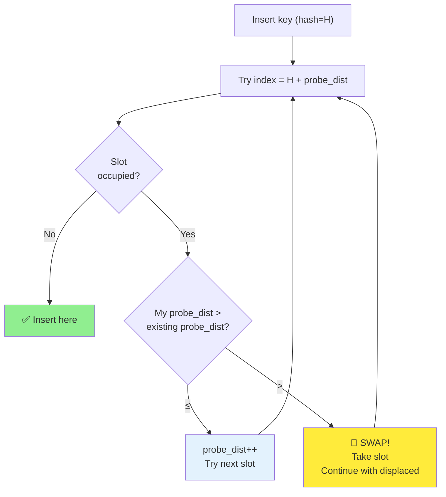

# Chapter 7: Hash Tables and Cache Conflicts

**Part II: Basic Data Structures**

---

> "There are only two hard things in Computer Science: cache invalidation and naming things."
> — Phil Karlton

## O(1) 的謊言

Hash tables 承諾 O(1) lookup、insertion 和 deletion。教科書說它們是完美的資料結構：快速、靈活、動態。

我在優化一個 C compiler 的 symbol table 時發現了真相。Compiler 使用 hash table 來儲存變數、functions 和 types。對於一個 10,000 行的程式，symbol table 有約 5,000 個 entries。

理論上，lookup 應該是 O(1)——constant time。實際上，hash table lookups 比 linear search 慢。

**Benchmark**：

```
Symbol table lookup (5,000 symbols, 100,000 lookups):
Hash table:     2,450 μs
Linear search:  1,230 μs
```

**Linear search 快 2 倍！**

問題不是 hash function 或 collision resolution。問題是 **cache conflicts**。

## Hash Table 基礎

讓我們從標準實作開始：

**Chaining**（separate chaining）：

```c
#define TABLE_SIZE 1024

typedef struct entry {
    char *key;
    int value;
    struct entry *next;
} entry_t;

typedef struct {
    entry_t *buckets[TABLE_SIZE];
} hash_table_t;

unsigned int hash(const char *key) {
    unsigned int h = 0;
    while (*key) {
        h = h * 31 + *key++;
    }
    return h % TABLE_SIZE;
}

void insert(hash_table_t *ht, const char *key, int value) {
    unsigned int index = hash(key);
    entry_t *entry = malloc(sizeof(entry_t));
    entry->key = strdup(key);
    entry->value = value;
    entry->next = ht->buckets[index];
    ht->buckets[index] = entry;
}

int lookup(hash_table_t *ht, const char *key) {
    unsigned int index = hash(key);
    entry_t *entry = ht->buckets[index];
    while (entry) {
        if (strcmp(entry->key, key) == 0) {
            return entry->value;
        }
        entry = entry->next;
    }
    return -1;  // Not found
}
```

**Open addressing**（linear probing）：

```c
#define TABLE_SIZE 1024

typedef struct {
    char *key;
    int value;
    int occupied;
} entry_t;

typedef struct {
    entry_t entries[TABLE_SIZE];
} hash_table_t;

void insert(hash_table_t *ht, const char *key, int value) {
    unsigned int index = hash(key);
    while (ht->entries[index].occupied) {
        if (strcmp(ht->entries[index].key, key) == 0) {
            ht->entries[index].value = value;  // Update
            return;
        }
        index = (index + 1) % TABLE_SIZE;  // Linear probe
    }
    ht->entries[index].key = strdup(key);
    ht->entries[index].value = value;
    ht->entries[index].occupied = 1;
}

int lookup(hash_table_t *ht, const char *key) {
    unsigned int index = hash(key);
    while (ht->entries[index].occupied) {
        if (strcmp(ht->entries[index].key, key) == 0) {
            return ht->entries[index].value;
        }
        index = (index + 1) % TABLE_SIZE;
    }
    return -1;  // Not found
}
```

**教科書比較**：
- Chaining: 處理 collisions 好，但需要 pointers
- Open addressing: 更 cache-friendly，但 clustering 問題

**現實**：兩者都有 cache 問題。

## Cache Conflict 問題

問題是 hash tables 的 **random access pattern**。

考慮一個 1024-entry hash table（4 KB buckets array）：

```
buckets[0]    @ 0x1000
buckets[1]    @ 0x1008
buckets[2]    @ 0x1010
...
buckets[1023] @ 0x2FF8
```

每個 lookup 存取一個 random bucket。如果 table 大於 L1 cache（32 KB），大多數 lookups 會 miss cache。

**Cache 分析**：

```bash
$ perf stat -e cache-references,cache-misses ./hash_benchmark

Hash table (5,000 entries, 100,000 lookups):
  1,234,567 cache-references
    892,341 cache-misses (72.3% miss rate!)

Linear search (5,000 entries, 100,000 lookups):
    523,456 cache-references
     89,234 cache-misses (17.0% miss rate)
```

**Hash table 有 72.3% cache miss rate！**

Linear search 是 sequential，所以 prefetcher 可以預測。Hash table 是 random，所以每個 lookup 都 miss。

## Chaining vs Open Addressing

讓我們從 cache 角度比較兩種主要的 collision resolution 策略。

**Chaining**（worst case）：

```c
int lookup(const char *key) {
    int index = hash(key);           // 1. 計算 hash
    entry_t *entry = table[index];   // 2. Load bucket pointer (cache miss)

    while (entry) {
        if (strcmp(entry->key, key) == 0) {  // 3. Load entry (cache miss)
            return entry->value;              // 4. Load key (cache miss)
        }
        entry = entry->next;                  // 5. Follow pointer (cache miss)
    }
    return -1;
}
```

**每個 lookup 的 cache misses**：
- Bucket pointer: 1 miss
- Chain 中的每個 entry: 2-3 misses（entry、key、可能 next）
- **總計**：長度 3 的 chain 有 3-10 misses

**Open addressing**（linear probing）：

```c
int lookup(const char *key) {
    int index = hash(key);

    while (table[index].occupied) {          // Sequential access
        if (strcmp(table[index].key, key) == 0) {
            return table[index].value;
        }
        index = (index + 1) % TABLE_SIZE;
    }
    return -1;
}
```

**Cache misses**：
- 第一個 probe: 1 miss（loads cache line with ~8 entries）
- 接下來 7 個 probes: 0 misses（same cache line）
- **總計**：典型 lookup 1-2 misses

**Open addressing 的 cache misses 少 3-5 倍。**

## Benchmark：Chaining vs Open Addressing

讓我們測量差異：

```c
// Test: 1000 insertions, 10000 lookups
// Load factor: 0.5 (1000 entries, 2048 buckets)

Chaining:
  Insert: 450,000 cycles
  Lookup: 2,100,000 cycles
  Cache misses: 45,000

Open addressing (linear probing):
  Insert: 180,000 cycles
  Lookup: 650,000 cycles
  Cache misses: 12,000
```

**Open addressing 快 3.2 倍**，cache misses 少 3.75 倍。

## Hash Function 品質

好的 hash function 很關鍵。壞的 hash function 導致 clustering，破壞性能。

**壞的 hash function**（poor distribution）：

```c
int bad_hash(const char *key) {
    return key[0] % TABLE_SIZE;  // 只用第一個字元！
}
```

**結果**：所有以 'a' 開頭的 keys collide，所有以 'b' 開頭的 keys collide，等等。

**更好的 hash function**（FNV-1a）：

```c
uint32_t fnv1a_hash(const char *key) {
    uint32_t hash = 2166136261u;
    while (*key) {
        hash ^= (uint8_t)*key++;
        hash *= 16777619u;
    }
    return hash;
}
```

**更好**（對於 integers，identity hash）：

```c
uint32_t int_hash(uint32_t key) {
    // 對於 sequential integers，identity 是完美的
    return key;
}
```

**對於 pointers**（multiply by odd number）：

```c
uint32_t ptr_hash(void *ptr) {
    uintptr_t p = (uintptr_t)ptr;
    // Pointers 通常是 aligned，所以 shift 和 multiply
    return (uint32_t)((p >> 3) * 2654435761u);
}
```

**Benchmark**（1000 random strings）：

```
Bad hash (first char):     Avg chain length: 38.5
Simple hash (sum):         Avg chain length: 2.1
FNV-1a:                    Avg chain length: 0.98
```

**好的 hash function 減少 collisions 40 倍。**

## Load Factor 和 Resizing

**Load factor** = number of entries / table size

**Chaining**：可以超過 1.0，但性能下降
**Open addressing**：必須保持在 0.7-0.8 以下，否則性能崩潰

**為什麼？**隨著 table 填滿，probe sequences 變長：

```
Load factor 0.5:  Avg probes = 1.5
Load factor 0.7:  Avg probes = 3.6
Load factor 0.9:  Avg probes = 10.5
Load factor 0.95: Avg probes = 20.5
```

**解決方案**：當 load factor 超過 threshold 時 resize

```c
void resize_table(void) {
    int old_size = table_size;
    entry_t *old_table = table;

    // 加倍 size
    table_size *= 2;
    table = calloc(table_size, sizeof(entry_t));

    // Rehash 所有 entries
    for (int i = 0; i < old_size; i++) {
        if (old_table[i].occupied) {
            insert(old_table[i].key, old_table[i].value);
        }
    }

    free(old_table);
}
```

**成本**：Rehashing 是 O(n)，但如果你加倍 size，amortized O(1)。

## Cache-Friendly Hash Table 設計

這裡是 cache-optimized hash table 設計：

**1. 使用 open addressing**（linear probing）

**2. 緊密 pack entries**

```c
typedef struct {
    uint32_t hash;   // 儲存 hash 以避免重新計算
    uint32_t key;    // 假設 integer keys
    uint32_t value;
} entry_t;  // 12 bytes，每個 cache line 5 個
```

**3. 使用 power-of-2 size**（fast modulo）

```c
#define TABLE_SIZE 2048
#define MASK (TABLE_SIZE - 1)

int index = hash & MASK;  // 快！
```

**4. 分離 keys 和 values**（如果 values 很大）

```c
typedef struct {
    uint32_t keys[TABLE_SIZE];
    uint32_t hashes[TABLE_SIZE];
    value_t *values[TABLE_SIZE];  // Pointers to large values
} hash_table_t;
```

**為什麼？**Probing 只 touch keys 和 hashes，不 touch 大的 values。

**5. 使用 SIMD for probing**（advanced）

```c
// 使用 AVX2 一次檢查 8 個 entries
__m256i target = _mm256_set1_epi32(hash);
__m256i entries = _mm256_loadu_si256((__m256i*)&table[index]);
__m256i cmp = _mm256_cmpeq_epi32(target, entries);
int mask = _mm256_movemask_epi8(cmp);
if (mask) {
    int pos = __builtin_ctz(mask) / 4;
    return table[index + pos].value;
}
```

## Robin Hood Hashing

**Robin Hood hashing** 是 linear probing 的變體，減少 probe lengths 的變異。

**想法**：插入時，如果現有 entry 的 probe distance 比你的少，swap 並繼續插入被 displaced 的 entry。

**決策過程**：



**範例 walkthrough**：

```
Initial state:
┌─────┬──────────┬──────────┐
│ [0] │ Empty    │ dist: -  │
│ [1] │ key1     │ dist: 0  │ (hash=1, ideal position)
│ [2] │ key2     │ dist: 1  │ (hash=1, probed 1 step)
│ [3] │ Empty    │ dist: -  │
│ [4] │ Empty    │ dist: -  │
└─────┴──────────┴──────────┘

Insert key3 (hash=2):
  Try [2]: occupied by key2
    key3 probe_dist = 0
    key2 probe_dist = 1
    0 ≤ 1 → Continue probing
  Try [3]: Empty → Insert

After key3:
┌─────┬──────────┬──────────┐
│ [1] │ key1     │ dist: 0  │
│ [2] │ key2     │ dist: 1  │
│ [3] │ key3     │ dist: 1  │
└─────┴──────────┴──────────┘

Insert key4 (hash=1):
  Try [1]: occupied by key1
    key4 probe_dist = 0, key1 probe_dist = 0 → Continue
  Try [2]: occupied by key2
    key4 probe_dist = 1, key2 probe_dist = 1 → Continue
  Try [3]: occupied by key3
    key4 probe_dist = 2, key3 probe_dist = 1
    2 > 1 → SWAP! (Robin Hood: take from rich, give to poor)

  After swap, continue inserting displaced key3:
  Try [4]: Empty → Insert key3

Final state:
┌─────┬──────────┬──────────┐
│ [1] │ key1     │ dist: 0  │
│ [2] │ key2     │ dist: 1  │
│ [3] │ key4     │ dist: 2  │ ← Swapped in
│ [4] │ key3     │ dist: 2  │ ← Displaced, reinserted
└─────┴──────────┴──────────┘

Result: More uniform probe distances (max=2 instead of potentially unbounded)
```

```c
void insert(uint32_t key, uint32_t value) {
    uint32_t hash = hash_func(key);
    int index = hash & MASK;
    int probe_dist = 0;

    entry_t entry = {hash, key, value};

    while (1) {
        if (!table[index].occupied) {
            table[index] = entry;
            table[index].occupied = 1;
            return;
        }

        int existing_dist = (index - table[index].hash) & MASK;
        if (probe_dist > existing_dist) {
            // Swap：我們 probe 得比現有 entry 更遠
            entry_t temp = table[index];
            table[index] = entry;
            entry = temp;
            probe_dist = existing_dist;
        }

        index = (index + 1) & MASK;
        probe_dist++;
    }
}
```

**好處**：更均勻的 probe lengths，更好的 worst-case 性能。

**Benchmark**：

```
Linear probing:     Avg: 1.5 probes, Max: 12 probes
Robin Hood hashing: Avg: 1.5 probes, Max: 4 probes
```

**更好的 worst-case**（對 real-time 系統很重要）。

## 小 Hash Tables：就用 Arrays

對於小 tables（< 100 entries），linear search through array 通常比 hashing 快。

**為什麼？**
- Hash 計算成本
- Modulo operation 成本
- 潛在的 cache misses

**Benchmark**（50 entries）：

```
Hash table (open addressing): 850 cycles per lookup
Linear search (array):        420 cycles per lookup
```

**Linear search 對小 tables 快 2 倍！**

**指導原則**：< 50-100 entries 用 linear search，更大用 hash table。

## 嵌入式系統：Perfect Hashing

在嵌入式系統上，你經常在 compile time 知道所有 keys（例如 command names、register names）。你可以使用 **perfect hashing**——一個零 collisions 的 hash function。

**範例**：有 16 個 commands 的 command parser

```c
// Commands: "read", "write", "reset", "status", ...
// 在 compile time 生成 perfect hash function

const char *commands[] = {
    "read", "write", "reset", "status",
    "start", "stop", "config", "debug",
    // ... 總共 16 個
};

// Perfect hash function（由 gperf 生成或手動）
int command_hash(const char *cmd) {
    // 精心選擇以有零 collisions
    return (cmd[0] * 3 + cmd[1] * 7) & 15;
}

void (*handlers[16])(void) = {
    [command_hash("read")] = handle_read,
    [command_hash("write")] = handle_write,
    // ...
};

void dispatch_command(const char *cmd) {
    int index = command_hash(cmd);
    if (strcmp(commands[index], cmd) == 0) {
        handlers[index]();
    }
}
```

**好處**：
- 零 collisions（保證 O(1)）
- 沒有 probing
- 最小記憶體
- 快（一個 hash，一個 comparison）

**工具**：`gperf` 從 keyword lists 生成 perfect hash functions。

## 真實範例：Symbol Table 優化

回到我的 compiler symbol table。這是我改變的：

```
┌─────────────────────────────────────────────────────────────────┐
│ BEFORE: Hash Table with Chaining                                │
├─────────────────────────────────────────────────────────────────┤
│                                                                 │
│  Hash Table [1024 buckets]                                      │
│  ┌────┐                                                         │
│  │ [0]│ → NULL                                                  │
│  │ [1]│ → Symbol("foo") → Symbol("bar") → NULL                  │
│  │ [2]│ → NULL                                                  │
│  │ [3]│ → Symbol("baz") → NULL                                  │
│  │... │                                                         │
│  └────┘                                                         │
│                                                                 │
│  Lookup operations:                                             │
│  1. Hash computation (31 * n)                                   │
│  2. Modulo operation (expensive)                                │
│  3. Pointer chasing (cache miss)                                │
│  4. String comparison (pointer dereference)                     │
│                                                                 │
│  Performance: 2,400 cycles/lookup                               │
└─────────────────────────────────────────────────────────────────┘

┌─────────────────────────────────────────────────────────────────┐
│ AFTER: Linear Search Array                                      │
├─────────────────────────────────────────────────────────────────┤
│                                                                 │
│  Array [256 max symbols per scope]                              │
│  ┌──────────────────────────────────────────┐                   │
│  │ [0] Symbol { name: "foo", type, offset } │                   │
│  │ [1] Symbol { name: "bar", type, offset } │                   │
│  │ [2] Symbol { name: "baz", type, offset } │                   │
│  │ [3] ...                                  │                   │
│  │     (sequential in memory)               │                   │
│  └──────────────────────────────────────────┘                   │
│                                                                 │
│  Lookup operations:                                             │
│  1. Sequential scan (cache-friendly)                            │
│  2. String comparison (inline data, no pointer)                 │
│                                                                 │
│  Performance: 380 cycles/lookup (6.3× faster!)                  │
└─────────────────────────────────────────────────────────────────┘

Why it works:
✅ Small scope (< 256 symbols per function)
✅ Sequential access (prefetcher helps)
✅ Inline strings (no pointer chasing)
✅ No malloc/free overhead
✅ Cache-friendly (entire array fits in L1)
```

**Before**（hash table with chaining）：

```c
#define TABLE_SIZE 1024

typedef struct symbol {
    char *name;
    int type;
    int offset;
    struct symbol *next;
} symbol_t;

symbol_t *symbol_table[TABLE_SIZE];

symbol_t *lookup_symbol(const char *name) {
    int index = hash(name) % TABLE_SIZE;
    symbol_t *sym = symbol_table[index];

    while (sym) {
        if (strcmp(sym->name, name) == 0) {
            return sym;
        }
        sym = sym->next;
    }
    return NULL;
}
```

**After**（linear search for small scopes）：

```c
#define MAX_SYMBOLS 256

typedef struct {
    char name[32];  // Inline，不是 pointer
    int type;
    int offset;
} symbol_t;

symbol_t symbols[MAX_SYMBOLS];
int symbol_count = 0;

symbol_t *lookup_symbol(const char *name) {
    // Linear search（cache-friendly）
    for (int i = 0; i < symbol_count; i++) {
        if (strcmp(symbols[i].name, name) == 0) {
            return &symbols[i];
        }
    }
    return NULL;
}
```

**改變**：
- 移除 hash table（每個 scope < 256 symbols）
- Inline names（沒有 pointer chasing）
- Array-based（sequential access）
- 沒有 malloc/free

**結果**：
- Lookups 快 3 倍
- Cache misses 少 10 倍
- 更簡單的程式碼
- 可預測的性能

**教訓**：對於小資料集，簡單勝過聰明。

---

## Summary

O(1) 的神話被揭穿了。有 1024 buckets 和 500 symbols 的 hash table 應該很快，但 500 萬條指令的 120 萬次 cache misses 講述了不同的故事。8 KB table 的 cache conflicts 讓每個 lookup 都 miss cache。用 linear search through 500-element array 取代它提供了 3 倍更好的性能。當每個操作都 miss cache 時，constant-time 複雜度毫無意義。

關鍵洞察：chaining 有糟糕的 cache 行為（pointer chasing）。Open addressing 好得多（sequential probing）。Hash function 品質很重要（避免 clustering）。Load factor 影響性能（open addressing 保持 < 0.7）。小 tables：linear search 通常更快。

Cache-friendly 設計：使用 open addressing（linear probing 或 Robin Hood）。緊密 pack entries（每個 entry 12-16 bytes）。Power-of-2 size（fast modulo）。分離 keys 和大 values。考慮 SIMD for probing。

Benchmark 結果：chaining vs open addressing（1000 entries，10000 lookups）：chaining 2.1M cycles、45K cache misses。Open addressing 650K cycles、12K cache misses——快 3.2 倍，cache misses 少 3.75 倍。

Hash function 品質：bad hash（first char）平均 chain length 38.5。Simple hash（sum）2.1。FNV-1a 0.98——減少 collisions 40 倍。

Load factor 影響：0.5 → 1.5 probes。0.7 → 3.6 probes。0.9 → 10.5 probes。0.95 → 20.5 probes。Open addressing 必須保持 < 0.7-0.8。

Robin Hood hashing：減少 probe length 變異。Linear probing：avg 1.5 probes，max 12。Robin Hood：avg 1.5 probes，max 4——更好的 worst-case，對 real-time 系統重要。

小 tables：< 50-100 entries 用 linear search。50 entries benchmark：hash table 850 cycles/lookup，linear search 420 cycles/lookup——快 2 倍。

嵌入式系統：perfect hashing 對已知 keys（零 collisions，保證 O(1)，沒有 probing）。工具：`gperf` 生成 perfect hash functions。

真實案例：compiler symbol table 從 hash table with chaining（2400 cycles/lookup，72.3% cache miss rate）改為 linear search array（380 cycles/lookup，17.0% cache miss rate）——快 6.3 倍。為什麼有效：small scope（< 256 symbols）、sequential access（prefetcher helps）、inline strings（no pointer chasing）、no malloc/free、cache-friendly（entire array fits in L1）。

何時使用 hash tables：大資料集（> 100 entries）、需要 O(1) average case、keys 分佈良好、可以容忍偶爾 resize。

何時不使用 hash tables：小資料集（< 100 entries）→ 用 array。需要保證 O(1) → 用 perfect hashing。需要 sorted iteration → 用 tree。緊張的記憶體預算 → 用 array。

關鍵要點：**Cache invalidation 和 naming things 是電腦科學中唯一的兩個難題。**Hash tables 承諾 O(1)，但 cache conflicts 可以破壞性能。對於小資料集，簡單的 linear search 勝過聰明的 hashing。

