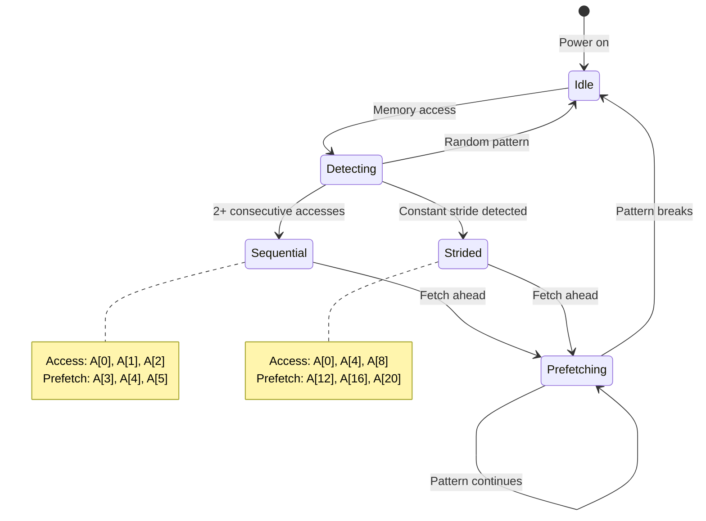

# Chapter 2: Memory Hierarchy

**Part I: Foundations**

---

> "Memory is the new disk, disk is the new tape."
> — Jim Gray

## The 100-Cycle Problem

In Chapter 1, we saw that cache misses cost 100-200 cycles while cache hits cost only 1-4 cycles. This isn't a minor detail—it's the single most important factor in modern performance.

Let me show you why.

I was optimizing a device driver for a RISC-V embedded system. The driver needed to process packets from a network interface, and we were dropping packets under load. The CPU was running at 1 GHz, and each packet required about 500 instructions to process. Simple math:

```
500 instructions ÷ 1 GHz = 500 nanoseconds per packet
```

At 500 ns per packet, we should handle 2 million packets per second. But we were only managing 200,000 packets per second—10× slower than expected.

The profiler told the story:

```bash
$ perf stat -e cycles,instructions,cache-misses ./driver_test
  Performance counter stats:
    5,000,000 cycles
      500,000 instructions
       45,000 cache-misses
```

Wait. 500,000 instructions should take 500,000 cycles (at 1 IPC). But we're seeing 5,000,000 cycles. Where did the extra 4.5 million cycles go?

**Cache misses**: 45,000 misses × 100 cycles = 4,500,000 cycles

The cache misses were dominating our execution time. The actual computation (500,000 cycles) was only 10% of the total time. The other 90% was waiting for memory.

This is the reality of modern computing: **memory is slow, and it's getting slower relative to CPU speed**.

## The Memory Hierarchy

Modern computers don't have "memory"—they have a **hierarchy** of memories, each with different speeds and sizes:

| Level | Type | Latency | Size |
|-------|------|---------|------|
| Registers | 32 registers | 1 cycle | ~128 B |
| L1 Cache | Split I/D | 3-4 cycles | 32-64 KB |
| L2 Cache | Unified | 12-15 cycles | 256-512 KB |
| L3 Cache (if present) | Shared | 40-50 cycles | 2-32 MB |
| DRAM | Main memory | 100-200 cycles | GB-TB |

**Key observations**:

1. **Speed decreases** as you go down (1 → 200 cycles)
2. **Size increases** as you go down (128 B → GB)
3. **The gap is huge**: DRAM is 100-200× slower than L1

On embedded systems, the hierarchy is often simpler:

**Typical MCU (e.g., RISC-V RV32IMC @ 100 MHz)**:

| Level | Type | Latency | Size |
|-------|------|---------|------|
| Registers | 32 registers | 1 cycle | 128 B |
| L1 I-Cache | Instruction | 1 cycle | 16 KB |
| L1 D-Cache/SRAM | Data | 1-2 cycles | 8-32 KB |
| Flash | Code storage | ~10 cycles | 128 KB - 1 MB |
| External DRAM (optional) | Data (if present) | 50-100 cycles | 8-64 MB |

**Embedded differences**:
- Smaller caches (8-64 KB vs 256 KB-32 MB)
- Often no L2/L3 cache
- Flash memory instead of DRAM for code
- Tighter memory budgets

## Cache Lines: The Fundamental Unit

Here's the crucial insight: **caches don't fetch individual bytes—they fetch cache lines**.

A cache line is typically **64 bytes** on modern processors (both desktop and embedded). When you access a single byte, the hardware fetches the entire 64-byte block containing that byte.

**Example**: Accessing a single integer

```c
int x = array[0];  // Access 4 bytes at address 0x1000
```

What actually happens:

```
CPU requests: 4 bytes at 0x1000
Cache fetches: 64 bytes from 0x1000 to 0x103F
```

The cache line includes:
- The requested integer (4 bytes)
- The next 15 integers (60 bytes)

This is why **sequential access is fast**:

```c
// Fast: All in the same cache line
for (int i = 0; i < 16; i++) {
    sum += array[i];  // First access: miss, next 15: hits
}
```

But **random access is slow**:

```c
// Slow: Each access likely in different cache line
for (int i = 0; i < 16; i++) {
    sum += array[random_index[i]];  // Each access: likely miss
}
```

## Cache Organization

Caches are organized into **sets** and **ways**. Understanding this helps explain cache conflicts.

**Direct-mapped cache** (1-way):

```
Address bits: [     Tag      |   Index   |      Offset      ]
               └─────────────┴───────────┴──────────────────
               Identifies     Selects     Byte within
               cache line     set         cache line
```

**Example**: 32 KB cache, 64-byte lines, direct-mapped
- Cache lines: 32 KB ÷ 64 B = 512 lines
- Index bits: log₂(512) = 9 bits
- Offset bits: log₂(64) = 6 bits
- Tag bits: remaining bits (e.g., 32 - 9 - 6 = 17 bits for 32-bit address)

**Problem with direct-mapped**: Cache conflicts

```c
int a[1024];  // At address 0x10000
int b[1024];  // At address 0x18000

// These two arrays map to the SAME cache sets!
// 0x10000 and 0x18000 differ only in bit 15
// Index uses bits 6-14, so they collide
```

**Set-associative cache** (N-way):

A 4-way set-associative cache has 4 "slots" per set:

```
Set 0: [Line 0] [Line 1] [Line 2] [Line 3]
Set 1: [Line 0] [Line 1] [Line 2] [Line 3]
...
```

When address maps to Set 0, it can go in any of the 4 slots. This reduces conflicts.

**Typical configurations**:
- L1: 8-way set-associative (32-64 KB)
- L2: 8-16-way set-associative (256-512 KB)
- L3: 16-way set-associative (2-32 MB)

**Embedded systems**:
- Often direct-mapped or 2-way (simpler hardware)
- Smaller caches mean more conflicts

## Spatial and Temporal Locality

Cache performance depends on two types of locality:

**Spatial locality**: Accessing nearby addresses
```c
// Good spatial locality
for (int i = 0; i < n; i++) {
    sum += array[i];  // Sequential access
}

// Poor spatial locality
for (int i = 0; i < n; i++) {
    sum += array[random[i]];  // Random access
}
```

**Temporal locality**: Accessing the same address repeatedly
```c
// Good temporal locality
int temp = array[0];
for (int i = 0; i < 1000; i++) {
    result += temp * i;  // Reuse 'temp'
}

// Poor temporal locality
for (int i = 0; i < 1000; i++) {
    result += array[i % 10] * i;  // Evicts before reuse
}
```

**Cache-friendly code** exploits both:

```c
// Matrix multiplication: cache-friendly version
for (int i = 0; i < N; i++) {
    for (int k = 0; k < N; k++) {
        int r = A[i][k];
        for (int j = 0; j < N; j++) {
            C[i][j] += r * B[k][j];  // Good spatial locality on B
        }
    }
}
```

## The Prefetcher

Modern CPUs have **hardware prefetchers** that predict memory access patterns and fetch data before you need it.

**How the prefetcher works**:



**Sequential prefetcher**: Detects sequential access

```c
// Prefetcher detects pattern and fetches ahead
for (int i = 0; i < n; i++) {
    sum += array[i];  // Prefetcher fetches array[i+1], array[i+2], ...
}
```

**Stride prefetcher**: Detects constant stride

```c
// Prefetcher detects stride of 8 bytes
for (int i = 0; i < n; i++) {
    sum += array[i * 2];  // Accessing every other element
}
```

**Prefetcher limitations**:

1. **Doesn't help random access**:
```c
for (int i = 0; i < n; i++) {
    sum += array[random[i]];  // Unpredictable, no prefetch
}
```

2. **Limited distance**: Typically 10-20 cache lines ahead

3. **Can be fooled**:
```c
// Alternating pattern confuses prefetcher
for (int i = 0; i < n; i++) {
    if (i % 2 == 0)
        sum += array[i];
    else
        sum += other_array[i];
}
```

**Embedded systems**: Many MCUs have **no prefetcher** or simple sequential-only prefetchers. This makes sequential access even more critical.

## Memory Bandwidth

Even with perfect cache behavior, you're limited by **memory bandwidth**.

**Example calculation** (desktop system):
- DDR4-3200: 25.6 GB/s per channel
- Dual channel: 51.2 GB/s total
- L3 cache: ~200 GB/s
- L2 cache: ~400 GB/s
- L1 cache: ~1000 GB/s

**Implication**: Streaming through large arrays is bandwidth-limited

```c
// Bandwidth-limited: streaming through 1 GB array
for (int i = 0; i < 256*1024*1024; i++) {
    array[i] = 0;  // Limited by DRAM bandwidth
}
```

**Embedded systems** have much lower bandwidth:
- Typical MCU SRAM: 1-4 GB/s
- External DRAM (if present): 100-500 MB/s

This makes **working set size** critical—keep data in on-chip SRAM.

## Cache Coherency (Multi-core)

On multi-core systems, caches must stay **coherent**—all cores see consistent data.

**MESI protocol** (common on x86, ARM):
- **M**odified: This cache has the only valid copy, modified
- **E**xclusive: This cache has the only valid copy, clean
- **S**hared: Multiple caches have valid copies
- **I**nvalid: This cache line is invalid

**False sharing**: Performance killer on multi-core

```c
// BAD: False sharing
struct {
    int counter_core0;  // Used by core 0
    int counter_core1;  // Used by core 1
} shared;  // Both in same cache line!

// Core 0 writes counter_core0 → invalidates core 1's cache line
// Core 1 writes counter_core1 → invalidates core 0's cache line
// Ping-pong effect: terrible performance
```

**Solution**: Pad to separate cache lines

```c
// GOOD: No false sharing
struct {
    int counter_core0;
    char pad[60];       // Pad to 64 bytes
    int counter_core1;
} shared;
```

**RISC-V**: Uses RVWMO (RISC-V Weak Memory Ordering) with `fence` instructions for synchronization.

## RISC-V Memory Model

RISC-V has a **weak memory model**—memory operations can be reordered unless you use fences.

**Memory ordering**:
```c
// Without fence: these can be reordered
store A
store B
load C
load D
```

**Fence instruction**:
```assembly
sw   a0, 0(a1)    # Store A
fence w, w        # Ensure store completes before next store
sw   a2, 0(a3)    # Store B
```

**Fence types**:
- `fence r, r`: Load-load fence
- `fence w, w`: Store-store fence
- `fence rw, rw`: Full fence
- `fence.i`: Instruction fence (for self-modifying code)

**Atomic operations** (A extension):
```assembly
lr.w  a0, (a1)    # Load-reserved
# ... modify a0 ...
sc.w  a2, a0, (a1) # Store-conditional (fails if reservation broken)
```

## Practical Guidelines

Based on this understanding of memory hierarchy, here are practical guidelines for data structure design:

**1. Minimize cache misses**
- Use sequential access patterns when possible
- Keep working set small (fit in L1/L2)
- Avoid pointer chasing (linked lists, trees)

**2. Exploit cache lines**
- Pack related data together (structs)
- Align data structures to cache line boundaries
- Avoid false sharing on multi-core

**3. Consider prefetcher**
- Use predictable access patterns
- Sequential or constant-stride access
- Avoid random access when possible

**4. Know your hardware**
- Cache sizes (L1, L2, L3)
- Cache line size (usually 64 bytes)
- Associativity (affects conflicts)
- Prefetcher capabilities

**5. Measure, don't guess**
- Use `perf` to measure cache misses
- Profile before optimizing
- Test on target hardware

## Summary

The 100-cycle problem was solved by understanding the memory hierarchy. The device driver's packet loss came from 45,000 cache misses consuming 4.5 million cycles—90% of execution time spent waiting for memory. Optimizing memory access patterns reduced cache misses and brought throughput from 200,000 to the expected 2 million packets per second.

**Key insights**:
- Cache misses cost 100-200 cycles (vs 1-4 for hits)
- Caches fetch 64-byte lines, not individual bytes
- Sequential access is 10-100× faster than random access
- Embedded systems have smaller caches and simpler hierarchies

**Design implications**:
- Arrays beat linked lists (spatial locality)
- Small working sets beat large ones (temporal locality)
- Sequential beats random (prefetcher)
- Measurement beats intuition (use profiling tools)

**Next Chapter**: We'll build a comprehensive benchmarking framework to measure these effects precisely and learn how to use profiling tools effectively.
