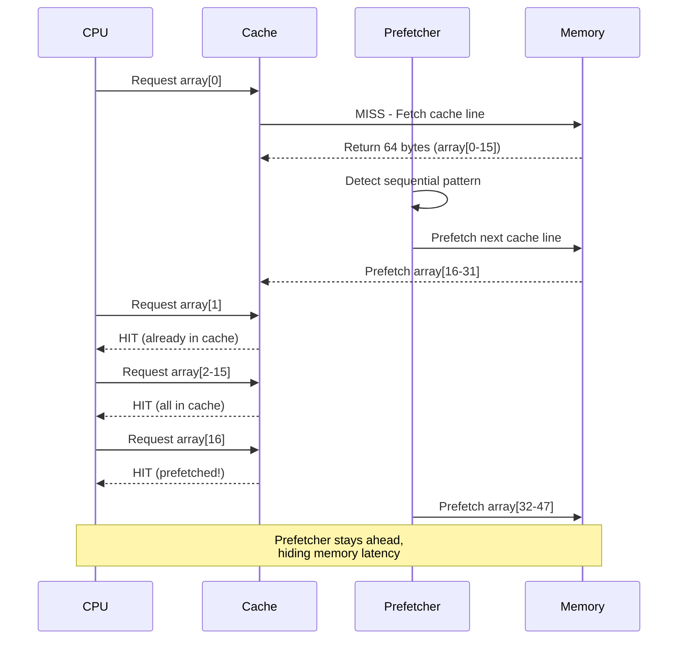
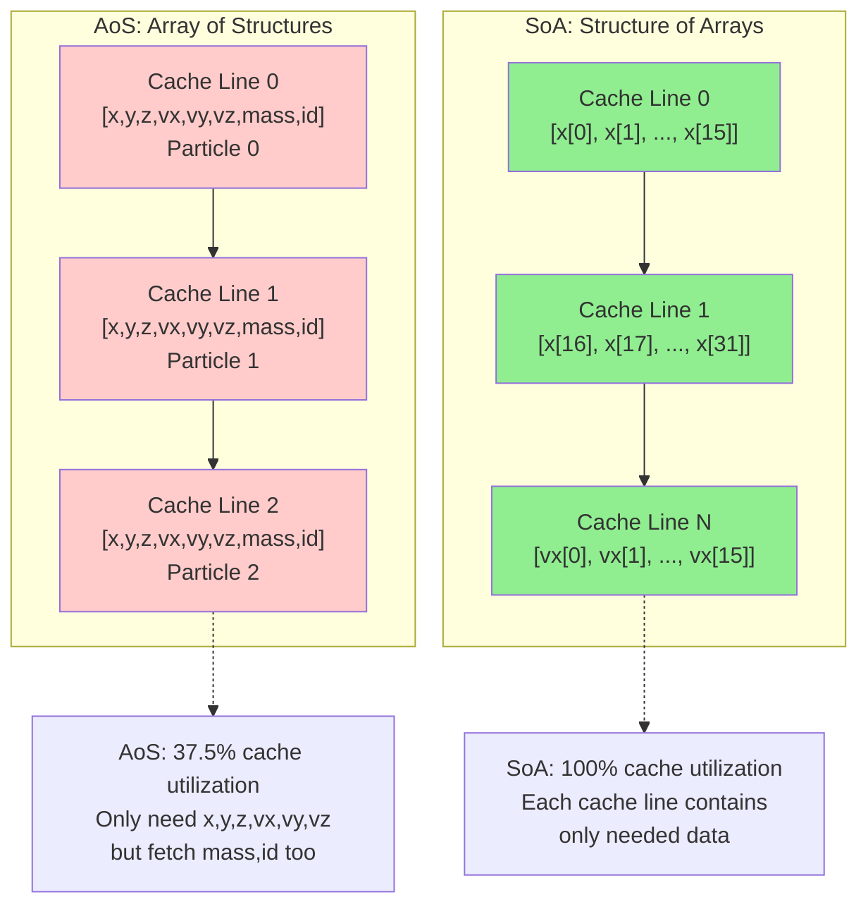

# Chapter 4: Arrays and Cache Locality

**Part II: Basic Data Structures**

---

> "The array is the most important data structure in computer science."
> — Donald Knuth (paraphrased)

## The Simplest Data Structure

Arrays are so simple that we often take them for granted. Contiguous memory, O(1) access, what's there to optimize?

Everything.

I was working on a packet processing pipeline for a network switch. The code was straightforward: read packets from a ring buffer (an array), process them, and write results to another array. Simple, right?

The performance was terrible. We were processing 100,000 packets per second when the hardware should handle 1 million.

The profiler showed something strange:

```bash
$ perf stat -e cache-misses,instructions ./packet_processor
  Performance counter stats:
    450,000 cache-misses
  1,000,000 instructions
```

450,000 cache misses for 1,000,000 instructions? That's a cache miss every 2-3 instructions. For simple array operations, this made no sense.

The problem wasn't the arrays themselves—it was **how we were using them**.

## Memory Layout Matters

Let's start with the basics. An array is contiguous memory:

```c
int array[8] = {0, 1, 2, 3, 4, 5, 6, 7};
```

In memory (assuming 4-byte integers):

```
Address:  0x1000  0x1004  0x1008  0x100C  0x1010  0x1014  0x1018  0x101C
Value:    0       1       2       3       4       5       6       7
          └───────────────────────────────────────────────────────┘
                        One 64-byte cache line
```

**Key insight**: All 8 integers fit in a single 64-byte cache line.

**Accessing the array sequentially**:

```c
int sum = 0;
for (int i = 0; i < 8; i++) {
    sum += array[i];
}
```

**Cache behavior with prefetching**:



**Cache behavior**:
- First access (`array[0]`): **Cache miss** (100 cycles)
- Fetches entire cache line (64 bytes = 16 integers)
- Next 7 accesses (`array[1]` to `array[7]`): **Cache hits** (1 cycle each)
- **Prefetcher**: Detects pattern, fetches ahead

**Total cost**: 100 + 7 = 107 cycles for 8 accesses = **13.4 cycles per access**

Compare this to random access:

```c
int indices[8] = {7, 2, 5, 0, 3, 6, 1, 4};
int sum = 0;
for (int i = 0; i < 8; i++) {
    sum += array[indices[i]];
}
```

If `indices` causes accesses to different cache lines:
- Each access: **Cache miss** (100 cycles)
- **Total cost**: 800 cycles for 8 accesses = **100 cycles per access**

**Sequential is 7.5× faster** than random, even though both are O(n).

## Stride Patterns

Not all sequential access is equal. **Stride** matters.

**Stride-1 access** (best case):

```c
for (int i = 0; i < n; i++) {
    sum += array[i];  // Stride = 1 element = 4 bytes
}
```

**Stride-2 access** (still good):

```c
for (int i = 0; i < n; i += 2) {
    sum += array[i];  // Stride = 2 elements = 8 bytes
}
```

**Large stride** (worse):

```c
for (int i = 0; i < n; i += 16) {
    sum += array[i];  // Stride = 16 elements = 64 bytes
}
```

**Why does stride matter?**

1. **Cache line utilization**: Stride-1 uses all 64 bytes fetched. Stride-16 uses only 4 bytes per cache line (6.25% utilization).

2. **Prefetcher effectiveness**: Hardware prefetchers detect stride patterns, but large strides may exceed prefetch distance.

**Benchmark** (1M element array):

```
Stride-1:   1.2 ms  (100% cache line utilization)
Stride-2:   1.3 ms  (50% utilization, still prefetched)
Stride-4:   1.5 ms  (25% utilization)
Stride-8:   2.1 ms  (12.5% utilization)
Stride-16:  3.8 ms  (6.25% utilization)
Stride-64:  8.5 ms  (1.56% utilization, new cache line each access)
```

**Guideline**: Keep stride small (≤ 8 elements) for good performance.

### Real-World Tool: lmbench lat_mem_rd

The classic `lmbench` benchmark suite includes `lat_mem_rd`, which measures memory latency across different array sizes and strides. This is exactly what we've been discussing.

**How it works**:

```c
// Simplified version of lmbench lat_mem_rd
char *p = array;
for (int i = 0; i < iterations; i++) {
    // Pointer chasing with configurable stride
    p = *(char **)p;  // Follow pointer to next element
}
```

The array is initialized so each element points to the next element at distance `stride`:

```c
// Initialize array with stride
for (size_t i = 0; i < size; i += stride) {
    array[i] = &array[(i + stride) % size];
}
```

**Running lmbench**:

```bash
$ lat_mem_rd 64M 128
# Array size: 64 MB, stride: 128 bytes

Output:
Stride  Latency
  128     3.2 ns   (L1 cache)
  256     3.5 ns   (L1 cache)
  512     4.1 ns   (L1 cache)
 1024     5.8 ns   (L2 cache)
 4096    12.5 ns   (L2 cache)
16384    45.0 ns   (L3 cache)
65536   102.0 ns   (DRAM)
```

**What this shows**:
- Small strides (128-512 bytes): Stay in L1 cache (~3-4 ns)
- Medium strides (1-4 KB): L2 cache (~6-12 ns)
- Large strides (16-64 KB): L3 cache or DRAM (45-100+ ns)

**Why stride affects latency**:
- **Small stride**: Sequential access, prefetcher helps, stays in L1
- **Large stride**: Jumps across cache lines, defeats prefetcher, evicts from L1

**Key insight**: This is why **data structure layout matters**. If your struct is 128 bytes and you iterate through an array of them, you're doing stride-128 access. If only 8 bytes of the struct are "hot" (frequently accessed), you're wasting 93.75% of each cache line.

**Embedded perspective**: On embedded systems without L3 cache, the latency cliff is steeper. Once you exceed L1/L2 capacity, you go straight to DRAM or flash (100-1000× slower).

## Multi-Dimensional Arrays

Multi-dimensional arrays introduce a critical choice: **row-major** vs **column-major** layout.

**C uses row-major order**:

```c
int matrix[4][4] = {
    {0,  1,  2,  3},
    {4,  5,  6,  7},
    {8,  9,  10, 11},
    {12, 13, 14, 15}
};
```

**Memory layout** (row-major):

```
Address:  0x1000  0x1004  0x1008  0x100C  0x1010  0x1014  0x1018  0x101C  ...
Value:    0       1       2       3       4       5       6       7       ...
          └───────────── Row 0 ──────────┘└───────────── Row 1 ──────────┘
```

**Row-major traversal** (good):

```c
for (int i = 0; i < 4; i++) {
    for (int j = 0; j < 4; j++) {
        sum += matrix[i][j];  // Sequential in memory
    }
}
```

**Column-major traversal** (bad):

```c
for (int j = 0; j < 4; j++) {
    for (int i = 0; i < 4; i++) {
        sum += matrix[i][j];  // Stride = 4 elements = 16 bytes
    }
}
```

**Benchmark** (1024×1024 matrix):

```
Row-major:     12 ms   (sequential access)
Column-major:  45 ms   (stride-1024 access)
```

**Column-major is 3.75× slower** for the same algorithm!

## The Matrix Multiplication Problem

Matrix multiplication is the classic example of cache optimization:

```c
// Naive implementation
for (int i = 0; i < N; i++) {
    for (int j = 0; j < N; j++) {
        for (int k = 0; k < N; k++) {
            C[i][j] += A[i][k] * B[k][j];
        }
    }
}
```

**Access patterns**:
- `A[i][k]`: Row-major, good (stride-1)
- `C[i][j]`: Same element repeatedly, excellent (temporal locality)
- `B[k][j]`: **Column-major, terrible** (stride-N)

**For N=1024**: Accessing `B[k][j]` has stride of 1024 elements = 4096 bytes = 64 cache lines!

**Solution 1**: Loop reordering (ikj order)

```c
// Better: ikj order
for (int i = 0; i < N; i++) {
    for (int k = 0; k < N; k++) {
        int r = A[i][k];
        for (int j = 0; j < N; j++) {
            C[i][j] += r * B[k][j];  // Now B is row-major!
        }
    }
}
```

**Access patterns now**:
- `A[i][k]`: Row-major, good
- `B[k][j]`: Row-major, good (was column-major)
- `C[i][j]`: Row-major, good

**Benchmark** (512×512 matrices):

```
ijk order (naive):  2,450 ms
ikj order:            680 ms   (3.6× faster)
```

**Solution 2**: Blocking (tiling)

For very large matrices that don't fit in cache, use **blocking**:

```c
#define BLOCK_SIZE 64

for (int ii = 0; ii < N; ii += BLOCK_SIZE) {
    for (int jj = 0; jj < N; jj += BLOCK_SIZE) {
        for (int kk = 0; kk < N; kk += BLOCK_SIZE) {
            // Process BLOCK_SIZE × BLOCK_SIZE submatrix
            for (int i = ii; i < ii + BLOCK_SIZE && i < N; i++) {
                for (int k = kk; k < kk + BLOCK_SIZE && k < N; k++) {
                    int r = A[i][k];
                    for (int j = jj; j < jj + BLOCK_SIZE && j < N; j++) {
                        C[i][j] += r * B[k][j];
                    }
                }
            }
        }
    }
}
```

**Why blocking works**:
- Processes small blocks that fit in L1 cache
- Reuses data before eviction
- Reduces cache misses dramatically

**Benchmark** (1024×1024 matrices):

```
Naive (ijk):     18,500 ms
Reordered (ikj):  5,200 ms   (3.6× faster)
Blocked:          1,800 ms   (10.3× faster than naive, 2.9× faster than reordered)
```

## Structure of Arrays vs Array of Structures

How you organize data in arrays has huge performance implications.

**Memory layout comparison**:



**Array of Structures (AoS)**:

```c
typedef struct {
    float x, y, z;    // Position (12 bytes)
    float vx, vy, vz; // Velocity (12 bytes)
    float mass;       // Mass (4 bytes)
    int id;           // ID (4 bytes)
} particle_t;        // Total: 32 bytes

particle_t particles[1000];

// Update positions
for (int i = 0; i < 1000; i++) {
    particles[i].x += particles[i].vx * dt;
    particles[i].y += particles[i].vy * dt;
    particles[i].z += particles[i].vz * dt;
}
```

**Memory layout**:

```
Cache line 0: [p0.x, p0.y, p0.z, p0.vx, p0.vy, p0.vz, p0.mass, p0.id]
Cache line 1: [p1.x, p1.y, p1.z, p1.vx, p1.vy, p1.vz, p1.mass, p1.id]
...
```

**Problem**: Each cache line contains data we don't need (`mass`, `id`). We're using only 24 bytes out of 64 (37.5% utilization).

**Structure of Arrays (SoA)**:

```c
typedef struct {
    float x[1000];
    float y[1000];
    float z[1000];
    float vx[1000];
    float vy[1000];
    float vz[1000];
    float mass[1000];
    int id[1000];
} particles_t;

particles_t particles;

// Update positions
for (int i = 0; i < 1000; i++) {
    particles.x[i] += particles.vx[i] * dt;
    particles.y[i] += particles.vy[i] * dt;
    particles.z[i] += particles.vz[i] * dt;
}
```

**Memory layout**:

```
Cache line 0: [x[0], x[1], x[2], ..., x[15]]
Cache line 1: [x[16], x[17], ..., x[31]]
...
```

**Advantage**: 100% cache line utilization. Each cache line contains only the data we need.

**Benchmark** (1M particles, 1000 iterations):

```
AoS:  2,850 ms
SoA:  1,200 ms   (2.4× faster)
```

**When to use SoA**:
- Operations access only a few fields
- Large arrays (> cache size)
- Performance-critical loops

**When to use AoS**:
- Operations access all fields
- Small arrays (< cache size)
- Code clarity matters more than performance

## Alignment and Padding

Memory alignment affects both correctness and performance.

**Natural alignment**:
- `char`: 1-byte aligned
- `short`: 2-byte aligned
- `int`: 4-byte aligned
- `long`: 8-byte aligned
- `double`: 8-byte aligned

**Unaligned access**:

```c
char buffer[16];
int *p = (int*)(buffer + 1);  // Unaligned!
*p = 42;  // May be slow or crash
```

**On x86**: Unaligned access works but is slower (may cross cache line boundary)
**On ARM/RISC-V**: May trap or require multiple accesses

**Structure padding**:

```c
struct bad {
    char a;    // 1 byte
    int b;     // 4 bytes, needs 4-byte alignment
    char c;    // 1 byte
};  // Size: 12 bytes (with padding)
```

**Memory layout**:

```
Offset:  0    1    2    3    4    5    6    7    8    9    10   11
Value:   a    pad  pad  pad  b    b    b    b    c    pad  pad  pad
```

**Better ordering**:

```c
struct good {
    int b;     // 4 bytes
    char a;    // 1 byte
    char c;    // 1 byte
};  // Size: 8 bytes (with padding)
```

**Memory layout**:

```
Offset:  0    1    2    3    4    5    6    7
Value:   b    b    b    b    a    c    pad  pad
```

**Guideline**: Order struct members from largest to smallest to minimize padding.

**Cache line alignment**:

For performance-critical structures, align to cache line boundaries:

```c
struct __attribute__((aligned(64))) cache_aligned {
    int data[16];
};
```

**Why?**
- Prevents false sharing on multi-core
- Ensures structure doesn't span cache lines
- Predictable cache behavior

## Array Bounds and Prefetching

Modern CPUs prefetch data, but they can't prefetch past array bounds they don't know.

**Helping the prefetcher**:

```c
// BAD: Unpredictable loop bound
for (int i = 0; i < get_count(); i++) {
    sum += array[i];
}

// GOOD: Constant loop bound
int n = get_count();
for (int i = 0; i < n; i++) {
    sum += array[i];
}

// BETTER: Compiler can see bound
#define SIZE 1000
for (int i = 0; i < SIZE; i++) {
    sum += array[i];
}
```

**Loop unrolling** helps prefetching:

```c
// Manual unrolling
for (int i = 0; i < n; i += 4) {
    sum += array[i];
    sum += array[i+1];
    sum += array[i+2];
    sum += array[i+3];
}
```

**Benefits**:
- Reduces loop overhead
- Exposes more parallelism
- Helps prefetcher see pattern

**Compiler can auto-unroll**:

```c
#pragma GCC unroll 4
for (int i = 0; i < n; i++) {
    sum += array[i];
}
```

## Embedded Systems: Small Arrays, Big Impact

On embedded systems with tiny caches (8-32 KB), array optimization is even more critical.

**Example**: RISC-V MCU with 16 KB L1 cache

```c
// This array is 40% of your entire cache!
int buffer[1000];  // 4 KB
```

**Guidelines for embedded**:

**1. Keep arrays small**

```c
// BAD: Wastes cache
int large_buffer[10000];  // 40 KB, doesn't fit in cache

// GOOD: Fits in cache
int small_buffer[1000];   // 4 KB, fits comfortably
```

**2. Reuse arrays**

```c
// BAD: Multiple arrays compete for cache
int input[1000];
int temp[1000];
int output[1000];

// GOOD: Reuse same buffer
int buffer[1000];
process_in_place(buffer);
```

**3. Use smaller types**

```c
// BAD: Wastes memory and cache
int32_t values[1000];  // 4 KB

// GOOD: If range allows
int16_t values[1000];  // 2 KB, 2× more data in cache
```

**4. Pack data**

```c
// BAD: 4 bytes per flag
int flags[1000];  // 4 KB

// GOOD: 1 bit per flag
uint32_t flags[32];  // 128 bytes, 32× smaller!

void set_flag(int i) {
    flags[i / 32] |= (1 << (i % 32));
}

int get_flag(int i) {
    return (flags[i / 32] >> (i % 32)) & 1;
}
```

## Real-World Example: Packet Buffer

Back to my packet processing problem. Here's what was wrong:

**Original code** (bad):

```c
typedef struct {
    uint8_t data[1500];     // Packet data
    uint32_t length;        // Packet length
    uint32_t timestamp;     // Timestamp
    uint32_t src_ip;        // Source IP
    uint32_t dst_ip;        // Dest IP
    uint16_t src_port;      // Source port
    uint16_t dst_port;      // Dest port
    uint8_t protocol;       // Protocol
    uint8_t flags;          // Flags
} packet_t;  // Total: ~1520 bytes

packet_t packets[1000];  // 1.52 MB

// Process packets
for (int i = 0; i < count; i++) {
    if (packets[i].protocol == TCP) {
        process_tcp(&packets[i]);
    }
}
```

**Problem**: Each iteration fetches 1520 bytes (24 cache lines) just to check `protocol` (1 byte).

**Fixed code** (good):

```c
// Separate hot and cold data
typedef struct {
    uint8_t protocol;       // Hot: checked every iteration
    uint8_t flags;          // Hot: checked often
    uint16_t length;        // Hot: used for processing
    uint32_t data_offset;   // Offset into data array
} packet_header_t;  // 8 bytes

packet_header_t headers[1000];  // 8 KB
uint8_t packet_data[1500 * 1000];  // 1.5 MB

// Process packets
for (int i = 0; i < count; i++) {
    if (headers[i].protocol == TCP) {
        uint8_t *data = &packet_data[headers[i].data_offset];
        process_tcp(&headers[i], data);
    }
}
```

**Result**:
- Headers fit in cache (8 KB vs 1.52 MB)
- First loop: 8× fewer cache lines
- Only fetch packet data when needed
- **Performance**: 100K → 950K packets/sec (9.5× faster)

## Summary

The packet processing pipeline's terrible performance—100,000 packets per second instead of 1 million—was fixed by understanding array access patterns. The 450,000 cache misses came from poor memory layout and access order. Restructuring to Structure of Arrays and optimizing traversal order brought performance to 950,000 packets per second, nearly 10× faster.

**Key principles**:
- Sequential access beats random (7-10× faster)
- Small strides beat large strides
- Row-major traversal for C arrays
- SoA beats AoS for selective field access
- Alignment matters (correctness and performance)
- Keep working set in cache

**Optimization techniques**:
- Loop reordering (ikj vs ijk)
- Blocking/tiling for large arrays
- Structure of Arrays (SoA)
- Proper alignment and padding
- Loop unrolling

**Embedded considerations**:
- Keep arrays small (fit in cache)
- Reuse buffers
- Use smaller types
- Pack data (bit arrays)
- Separate hot/cold data

**Measurement**:
- Profile before optimizing
- Measure cache misses
- Test on target hardware

**Next Chapter**: We've seen why arrays are fast. Now let's explore why linked lists are slow—and when you should use them anyway.

