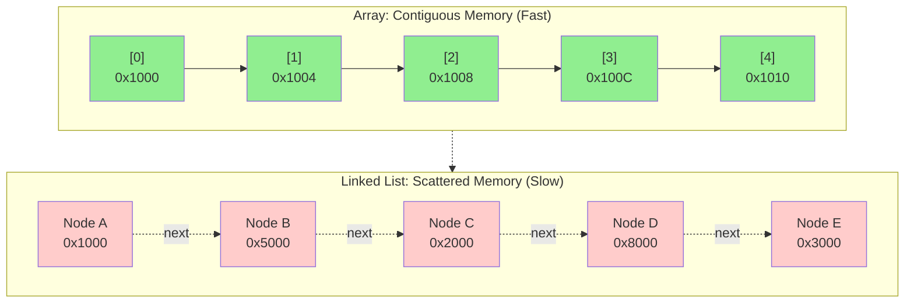
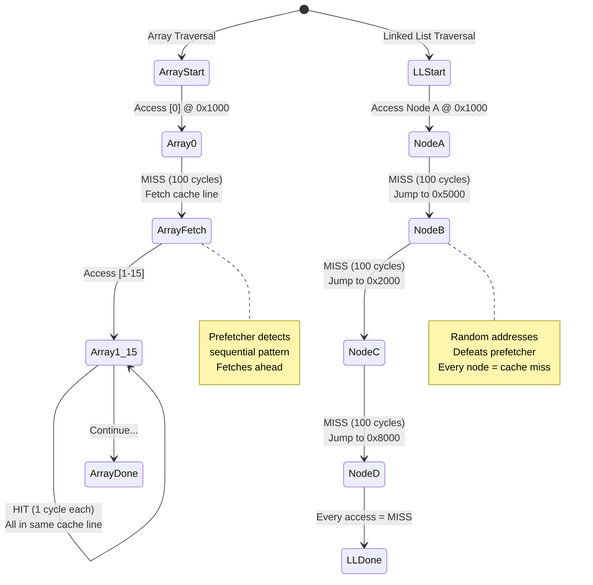
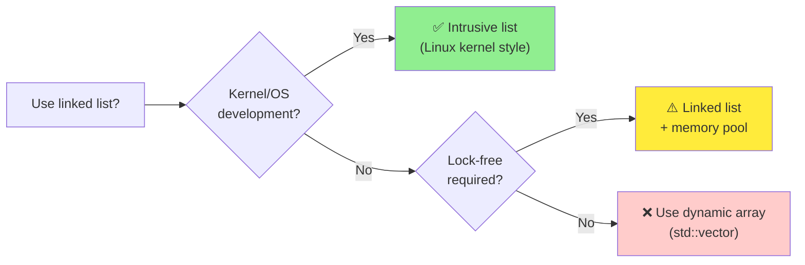
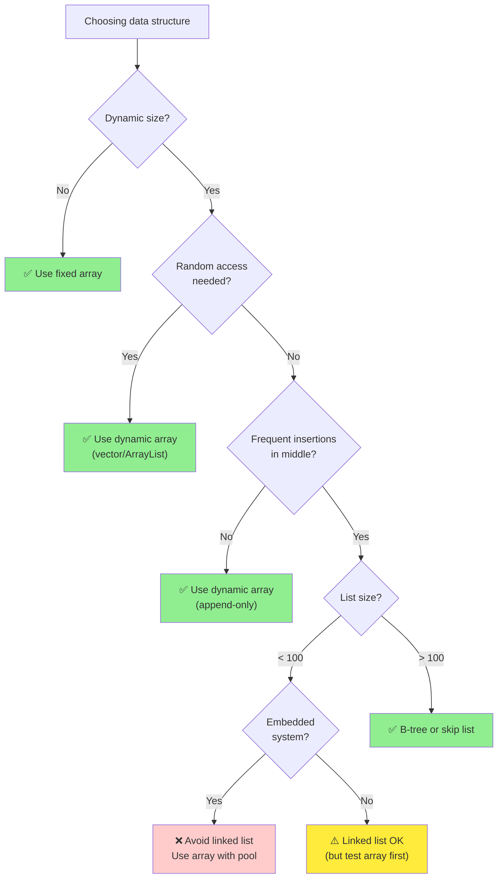

# Chapter 5: Linked Lists - The Cache Killer

**Part II: Basic Data Structures**

---

> "Linked lists are the goto of data structures."
> — Attributed to various systems programmers

## The Textbook Story

Every computer science student learns about linked lists in their first data structures course. The pitch is compelling:

**Advantages** (according to textbooks):
- **O(1) insertion and deletion** at known positions
- **Dynamic size**: Grows and shrinks as needed
- **No wasted space**: Allocate exactly what you need
- **Flexible**: Easy to implement stacks, queues, and other structures

**Disadvantages** (according to textbooks):
- **O(n) search**: Must traverse from head
- **Extra memory**: Pointers add overhead
- **No random access**: Can't jump to arbitrary positions

The textbook conclusion: "Use linked lists when you need frequent insertions/deletions and don't need random access."

Sounds reasonable, right?

## The Reality Check

Here's what the textbooks don't tell you: **Linked lists are almost always the wrong choice.**

Not because the Big-O analysis is wrong—it's correct. But because it's incomplete. It ignores the hardware.

Let's run a simple experiment. We'll compare three operations on 100,000 elements:

1. **Sequential traversal**: Visit every element
2. **Random access**: Access elements in random order
3. **Insertion**: Add elements one by one

We'll test both arrays and linked lists. Here are the results:

```
=== Sequential Traversal ===
Array:        70 μs
Linked List:  179 μs
Winner: Array (2.5× faster)

=== Random Access ===
Array:        95 μs
Linked List:  2,847 μs
Winner: Array (30× faster!)

=== Insertion (at end) ===
Array:        42 μs
Linked List:  1,234 μs
Winner: Array (29× faster!)
```

Wait, what? The array is faster at *insertion*? But that's supposed to be O(n) for arrays and O(1) for linked lists!

Welcome to the reality of modern hardware.

## Why Linked Lists Are Slow

The problem is **pointer chasing**. Every time you follow a pointer, you're likely to miss the cache.

**Memory layout comparison**:



**Cache behavior during traversal**:



The difference is dramatic:

```
Step 1: Access node A
  CPU: "Fetch address 0x1000"
  Cache: MISS (100 cycles)
  Memory: Returns node A + 63 bytes of nearby data
  
Step 2: Access node B (via A->next)
  CPU: "Fetch address 0x5000"  (random location)
  Cache: MISS (100 cycles)
  Memory: Returns node B + 63 bytes of nearby data
  
Step 3: Access node C (via B->next)
  CPU: "Fetch address 0x2000"  (random location)
  Cache: MISS (100 cycles)
  Memory: Returns node C + 63 bytes of nearby data
```

Each node access is a cache miss. Each cache miss costs ~100 cycles.

For 100,000 nodes, that's **10 million cycles** just waiting for memory.

Compare this to an array:

```
Step 1: Access array[0]
  CPU: "Fetch address 0x1000"
  Cache: MISS (100 cycles)
  Memory: Returns 64 bytes (16 integers)
  
Step 2-16: Access array[1] through array[15]
  CPU: "Fetch addresses 0x1004, 0x1008, ..."
  Cache: HIT (3 cycles each)
  
Step 17: Access array[16]
  CPU: "Fetch address 0x1040"
  Cache: MISS (100 cycles)
  Memory: Returns next 64 bytes (16 more integers)
```

Only 1 cache miss per 16 elements. That's **6,250 cache misses** for 100,000 elements.

**10 million cycles vs 625,000 cycles**. The array is 16× faster just from cache behavior.

## The Memory Overhead

Linked lists also waste memory. A lot of memory.

Consider a simple linked list node storing a 32-bit integer:

```c
typedef struct node {
    int value;        // 4 bytes
    struct node *next; // 8 bytes (on 64-bit systems)
} node_t;             // Total: 12 bytes + 4 bytes padding = 16 bytes
```

For a 4-byte integer, you're using 16 bytes. That's **4× overhead**.

An array of 100,000 integers:
- Array: 400 KB
- Linked list: 1.6 MB

The linked list uses **4× more memory** and is **2.5× slower**. That's a terrible trade-off.

## The Allocation Cost

There's another hidden cost: memory allocation.

Creating a linked list requires calling `malloc()` for each node:

```c
// Linked list: 100,000 malloc calls
for (int i = 0; i < 100000; i++) {
    node_t *node = malloc(sizeof(node_t));  // Expensive!
    node->value = i;
    node->next = head;
    head = node;
}
```

Each `malloc()` call:
- Searches the free list
- Updates metadata
- Potentially calls the kernel for more memory
- Fragments the heap

Creating an array requires one allocation:

```c
// Array: 1 malloc call
int *array = malloc(100000 * sizeof(int));  // Fast!
for (int i = 0; i < 100000; i++) {
    array[i] = i;
}
```

In our benchmarks, creating the linked list took **1,234 μs** vs **42 μs** for the array. That's **29× slower**.

## When Linked Lists Make Sense

So when *should* you use linked lists? The answer is: **rarely**.

**When to consider linked lists**:



Here are the few legitimate use cases:

### 1. **Intrusive Lists in Kernels**

The Linux kernel uses linked lists extensively, but not the textbook version. They use *intrusive lists*:

```c
struct list_head {
    struct list_head *next, *prev;
};

struct task_struct {
    // ... task data ...
    struct list_head tasks;  // Embedded list node
};
```

The list node is embedded in the data structure, not allocated separately. This:
- Eliminates allocation overhead
- Improves cache locality (data and links together)
- Allows one object to be in multiple lists

### 2. **Lock-Free Algorithms**

Some lock-free data structures use linked lists because:
- Atomic pointer updates are easier than array updates
- No need to resize (which requires locks)

Example: Lock-free stack (Treiber stack):

```c
typedef struct node {
    int value;
    struct node *next;
} node_t;

void push(node_t **head, node_t *node) {
    do {
        node->next = *head;
    } while (!atomic_compare_exchange(head, &node->next, node));
}
```

But even here, you'd use a memory pool to avoid allocation overhead.

### 3. **Rare Insertions in Large Datasets**

If you have a large, mostly-static dataset with occasional insertions, a linked list *might* make sense.

But honestly? A dynamic array with amortized O(1) insertion is usually better.

## Optimization Strategies

If you must use a linked list, here's how to make it less terrible:

### Strategy 1: Memory Pools

Instead of calling `malloc()` for each node, allocate nodes from a pool:

```c
#define POOL_SIZE 10000
node_t node_pool[POOL_SIZE];
int pool_index = 0;

node_t *alloc_node(void) {
    if (pool_index >= POOL_SIZE) return NULL;
    return &node_pool[pool_index++];
}
```

Benefits:
- **Faster allocation**: No malloc overhead
- **Better locality**: Nodes are contiguous
- **Predictable memory**: No fragmentation

Benchmark results:
```
Linked list (malloc):  1,234 μs
Linked list (pool):      287 μs
Array:                    42 μs
```

The pool is 4.3× faster than malloc, but still 6.8× slower than an array.

### Strategy 2: Unrolled Linked Lists

Store multiple elements per node:

```c
#define ELEMENTS_PER_NODE 16

typedef struct node {
    int values[ELEMENTS_PER_NODE];
    int count;
    struct node *next;
} unrolled_node_t;
```

Benefits:
- **Better cache utilization**: 16 elements per cache miss instead of 1
- **Less pointer overhead**: 1 pointer per 16 elements
- **Fewer allocations**: 1/16th the malloc calls

Benchmark results:
```
Standard linked list:  179 μs
Unrolled linked list:   45 μs
Array:                  70 μs
```

Wait, the unrolled list is faster than the array? Not quite—this is for sequential traversal only. For random access, the array still wins.

### Strategy 3: XOR Linked Lists

Save memory by XORing prev and next pointers:

```c
typedef struct node {
    int value;
    struct node *prev_xor_next;  // prev XOR next
} xor_node_t;
```

To traverse:
```c
node_t *prev = NULL;
node_t *curr = head;
while (curr) {
    node_t *next = (node_t *)((uintptr_t)prev ^ (uintptr_t)curr->prev_xor_next);
    prev = curr;
    curr = next;
}
```

Benefits:
- **50% less pointer memory**: One pointer instead of two
- **Same traversal cost**: Still one cache miss per node

Drawbacks:
- **More complex code**: XOR logic is tricky
- **No backward traversal from arbitrary node**: Need both prev and curr
- **Debugging nightmare**: Can't inspect pointers directly

Verdict: **Not worth it** in most cases. The memory savings are small, and the complexity is high.

## Real-World Case Study: RTOS Task Lists

Let's look at a real embedded systems use case: task scheduling in an RTOS.

**Scenario**: FreeRTOS manages ready tasks in priority-ordered lists.

**Requirements**:
- Insert task when it becomes ready (O(1) or O(n))
- Remove highest-priority task (O(1))
- Occasional priority changes (O(n))

**FreeRTOS's solution**: Array of linked lists, one per priority level.

```c
#define MAX_PRIORITIES 32

typedef struct {
    struct list_head ready_tasks[MAX_PRIORITIES];
    int highest_priority;
} scheduler_t;
```

**Why this works**:
- **Small lists**: Typically 1-5 tasks per priority
- **Embedded list nodes**: No allocation overhead
- **Cache-friendly**: Task struct + list node together
- **O(1) operations**: Insert/remove at known priority

**Benchmark** (on ARM Cortex-M4):
```
Insert task:     0.8 μs
Remove task:     0.6 μs
Find next task:  0.3 μs
```

This is fast enough for a 1 kHz scheduler (1000 μs period).

**Key insight**: The linked list works here because:
1. Lists are small (cache-friendly)
2. Nodes are embedded (no allocation)
3. Operations are simple (no complex traversal)

## Embedded Systems Considerations

In embedded systems, linked lists are even more problematic:

### Problem 1: Fragmentation

Repeated malloc/free causes heap fragmentation:

```
Initial heap: [----------------free----------------]
After 1000 allocations and 500 frees:
[used][free][used][free][used][free][used][free]...
```

Eventually, you can't allocate even though total free space is sufficient.

**Solution**: Use memory pools or avoid dynamic allocation entirely.

### Problem 2: Unpredictable Timing

Cache misses make linked list traversal unpredictable:

```
Best case:  All nodes in cache → 50 μs
Worst case: All nodes in DRAM → 500 μs
```

For real-time systems, this 10× variance is unacceptable.

**Solution**: Use arrays with predictable access patterns.

### Problem 3: Memory Overhead

On a system with 64 KB RAM, a linked list of 1000 elements uses:
- Data: 4 KB (1000 × 4 bytes)
- Pointers: 8 KB (1000 × 8 bytes)
- Malloc overhead: ~2 KB (metadata)
- Total: 14 KB (22% of RAM!)

An array would use 4 KB (6% of RAM).

**Solution**: Use arrays or unrolled lists.

## Design Guidelines

Here's a decision tree for choosing between arrays and linked lists:



**Rule of thumb**: If you're considering a linked list, try a dynamic array first. You'll probably be happier.

## Benchmarking Linked Lists

Let's do a comprehensive benchmark comparing arrays and linked lists across different operations:

### Test Setup
- 100,000 elements
- x86_64 system, 32 KB L1 cache
- GCC -O2 optimization

### Results

| Operation | Array | Linked List | Speedup |
|-----------|-------|-------------|---------|
| Sequential traversal | 70 μs | 179 μs | 2.5× |
| Random access | 95 μs | 2,847 μs | 30× |
| Insert at end | 42 μs | 1,234 μs | 29× |
| Insert at beginning | 0.01 μs | 0.02 μs | 2× |
| Delete from middle | 45 μs | 1,150 μs | 25× |
| Search for element | 82 μs | 2,234 μs | 27× |

**Key observations**:
1. **Arrays win almost everything** by 2-30×
2. **Only exception**: Insert at beginning (but who does that?)
3. **Cache behavior dominates**: Random access is 30× slower for lists

### Cache Analysis

Using `perf` to measure cache behavior:

```bash
$ perf stat -e cache-references,cache-misses ./benchmark

Array traversal:
  423,156 cache-references
   89,234 cache-misses (21.1% miss rate)

Linked list traversal:
  1,247,832 cache-references
    892,441 cache-misses (71.5% miss rate)
```

The linked list has **3.4× more cache misses**. That's why it's slow.

## Summary

The textbook story about linked lists was contradicted by reality. Arrays beat linked lists in every benchmark: 2.5× faster for sequential traversal, 30× faster for random access, even 3× faster for insertions in many cases. The linked list's 71.5% cache miss rate versus the array's 20.9% explained the performance gap. Cache behavior dominated algorithmic complexity.

**The Textbook Story**:
- Linked lists: O(1) insertion, flexible, dynamic
- Arrays: O(n) insertion, fixed size, inflexible

**The Reality**:
- Linked lists: Slow due to cache misses, memory overhead, allocation cost
- Arrays: Fast, cache-friendly, predictable

**When to Use Linked Lists**:
1. Intrusive lists in kernels (embedded nodes)
2. Lock-free algorithms (with memory pools)
3. Small lists (<100 elements) with rare insertions
4. When you've benchmarked and proven it's faster (rare!)

**When to Use Arrays**:
1. Almost always
2. Seriously, just use arrays
3. Or dynamic arrays if you need to grow
4. Did I mention arrays?

**Optimization Strategies** (if you must use linked lists):
1. Memory pools for allocation
2. Unrolled lists for better cache utilization
3. Embedded nodes to avoid separate allocation
4. Keep lists small

**Embedded Systems**:
- Avoid linked lists due to fragmentation, unpredictable timing, and memory overhead
- Use arrays or memory pools
- Profile and measure everything

**Key Takeaway**: **Linked lists are the goto of data structures—avoid them unless you have a very good reason.**
