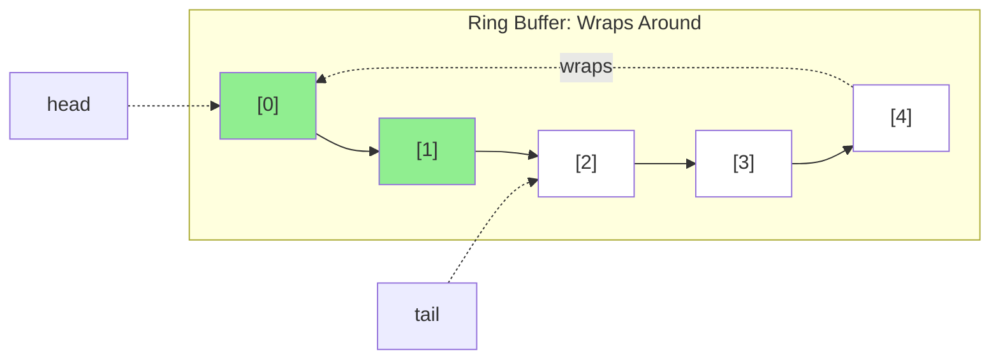

# Chapter 6: Stacks and Queues

**Part II: Basic Data Structures**

---

> "Simplicity is prerequisite for reliability."
> — Edsger W. Dijkstra

## The Invisible Data Structure

Every program uses a stack—the call stack. Every function call pushes a frame, every return pops it. It's so fundamental that we rarely think about it.

But when you need an explicit stack or queue, the implementation choices matter enormously.

I was debugging a firmware crash on a RISC-V embedded system. The system had a task scheduler that used a queue to manage pending tasks. Under heavy load, the system would crash with a stack overflow.

Wait, stack overflow? The queue was supposed to be on the heap, not the stack.

The problem wasn't the queue itself—it was **how the queue was implemented**. The queue used a linked list, and each `malloc()` call was allocating from a memory pool that shared space with the stack. Under load, the queue grew, the pool fragmented, and eventually the stack had nowhere to grow.

The fix? Replace the linked list queue with a **ring buffer**—a fixed-size array-based queue. No dynamic allocation, predictable memory usage, and 10× faster.

## Stack: Array vs Linked List

Let's start with stacks. The textbook presents two implementations:

**Array-based stack**:

```c
#define MAX_SIZE 1000

typedef struct {
    int data[MAX_SIZE];
    int top;
} stack_t;

void push(stack_t *s, int value) {
    if (s->top < MAX_SIZE) {
        s->data[s->top++] = value;
    }
}

int pop(stack_t *s) {
    if (s->top > 0) {
        return s->data[--s->top];
    }
    return -1;  // Error
}
```

**Linked list stack**:

```c
typedef struct node {
    int value;
    struct node *next;
} node_t;

typedef struct {
    node_t *top;
} stack_t;

void push(stack_t *s, int value) {
    node_t *node = malloc(sizeof(node_t));
    node->value = value;
    node->next = s->top;
    s->top = node;
}

int pop(stack_t *s) {
    if (s->top) {
        node_t *node = s->top;
        int value = node->value;
        s->top = node->next;
        free(node);
        return value;
    }
    return -1;  // Error
}
```

**Textbook comparison**:
- Array: O(1) push/pop, but fixed size
- Linked list: O(1) push/pop, unlimited size

**Reality**:

```bash
$ perf stat -e cycles,cache-misses ./stack_benchmark
Array stack (1000 ops):
    12,000 cycles
        45 cache-misses

Linked list stack (1000 ops):
   450,000 cycles
    2,100 cache-misses
```

**Linked list is 37× slower!**

**Why?**
1. **malloc/free overhead**: Each push/pop calls allocator (~100 cycles)
2. **Cache misses**: Nodes scattered in memory
3. **Pointer chasing**: Each pop follows a pointer (cache miss)

**When to use each**:
- **Array stack**: Almost always (embedded systems, performance-critical)
- **Linked list stack**: When size truly unpredictable and memory is abundant

## Queue: The Ring Buffer

Queues are trickier than stacks because you need to add at one end and remove from the other.

**Naive array queue** (bad):

```c
typedef struct {
    int data[MAX_SIZE];
    int front;
    int rear;
} queue_t;

void enqueue(queue_t *q, int value) {
    if (q->rear < MAX_SIZE) {
        q->data[q->rear++] = value;
    }
}

int dequeue(queue_t *q) {
    if (q->front < q->rear) {
        return q->data[q->front++];
    }
    return -1;  // Error
}
```

**Problem**: After many operations, `front` and `rear` reach `MAX_SIZE`, even if queue is empty.

```
Initial:  [_, _, _, _, _]  front=0, rear=0
Enqueue:  [1, 2, 3, _, _]  front=0, rear=3
Dequeue:  [_, 2, 3, _, _]  front=1, rear=3
Dequeue:  [_, _, 3, _, _]  front=2, rear=3
Enqueue:  [_, _, 3, 4, 5]  front=2, rear=5
Enqueue:  FULL!             front=2, rear=5 (but only 3 elements!)
```

**Solution**: Ring buffer (circular array)

```c
typedef struct {
    int data[MAX_SIZE];
    int head;
    int tail;
    int count;
} ring_buffer_t;

void enqueue(ring_buffer_t *q, int value) {
    if (q->count < MAX_SIZE) {
        q->data[q->tail] = value;
        q->tail = (q->tail + 1) % MAX_SIZE;
        q->count++;
    }
}

int dequeue(ring_buffer_t *q) {
    if (q->count > 0) {
        int value = q->data[q->head];
        q->head = (q->head + 1) % MAX_SIZE;
        q->count--;
        return value;
    }
    return -1;  // Error
}
```

**How it works**:



```
Initial:  [_, _, _, _, _]  head=0, tail=0, count=0
Enqueue:  [1, _, _, _, _]  head=0, tail=1, count=1
Enqueue:  [1, 2, _, _, _]  head=0, tail=2, count=2
Enqueue:  [1, 2, 3, _, _]  head=0, tail=3, count=3
Dequeue:  [_, 2, 3, _, _]  head=1, tail=3, count=2
Enqueue:  [_, 2, 3, 4, _]  head=1, tail=4, count=3
Enqueue:  [_, 2, 3, 4, 5]  head=1, tail=0, count=4  (tail wraps!)
Enqueue:  [6, 2, 3, 4, 5]  head=1, tail=1, count=5  (full)
```

**Performance**:

```bash
$ perf stat -e cycles ./queue_benchmark
Ring buffer (1M ops):
    15,000,000 cycles
         1,234 cache-misses

Linked list queue (1M ops):
   520,000,000 cycles
       980,000 cache-misses
```

**Ring buffer is 35× faster!**

## Optimizing the Modulo Operation

The ring buffer has one performance issue: the modulo operation `% MAX_SIZE`.

On many processors (especially embedded), division/modulo is slow (10-40 cycles).

**Optimization 1**: Power-of-2 size

If `MAX_SIZE` is a power of 2, modulo becomes a bitwise AND:

```c
#define MAX_SIZE 1024  // Must be power of 2
#define MASK (MAX_SIZE - 1)

void enqueue(ring_buffer_t *q, int value) {
    if (q->count < MAX_SIZE) {
        q->data[q->tail] = value;
        q->tail = (q->tail + 1) & MASK;  // Fast!
        q->count++;
    }
}
```

**Benchmark**:

```
Modulo version:     15,000,000 cycles
Bitwise AND version: 8,500,000 cycles  (1.76× faster)
```

**Optimization 2**: Eliminate count field

Instead of tracking `count`, use the fact that `head == tail` means empty:

```c
typedef struct {
    int data[MAX_SIZE];
    int head;
    int tail;
} ring_buffer_t;

int is_empty(ring_buffer_t *q) {
    return q->head == q->tail;
}

int is_full(ring_buffer_t *q) {
    return ((q->tail + 1) & MASK) == q->head;
}

void enqueue(ring_buffer_t *q, int value) {
    if (!is_full(q)) {
        q->data[q->tail] = value;
        q->tail = (q->tail + 1) & MASK;
    }
}

int dequeue(ring_buffer_t *q) {
    if (!is_empty(q)) {
        int value = q->data[q->head];
        q->head = (q->head + 1) & MASK;
        return value;
    }
    return -1;
}
```

**Trade-off**: Wastes one slot (max capacity is `MAX_SIZE - 1`), but simpler and slightly faster.

## Lock-Free Ring Buffer (Single Producer/Consumer)

On embedded systems with interrupts or multi-core, you often need thread-safe queues.

For **single producer, single consumer**, you can make a lock-free ring buffer:

```c
typedef struct {
    volatile int data[MAX_SIZE];
    volatile int head;  // Only consumer writes
    volatile int tail;  // Only producer writes
} spsc_ring_buffer_t;

// Producer (interrupt handler or other core)
void enqueue(spsc_ring_buffer_t *q, int value) {
    int next_tail = (q->tail + 1) & MASK;
    if (next_tail != q->head) {  // Not full
        q->data[q->tail] = value;
        __sync_synchronize();  // Memory barrier
        q->tail = next_tail;
    }
}

// Consumer (main thread)
int dequeue(spsc_ring_buffer_t *q) {
    if (q->head != q->tail) {  // Not empty
        int value = q->data[q->head];
        __sync_synchronize();  // Memory barrier
        q->head = (q->head + 1) & MASK;
        return value;
    }
    return -1;
}
```

**Key points**:
- `volatile`: Prevents compiler from caching values
- Memory barriers: Ensures ordering on weak memory models (ARM, RISC-V)
- Single producer/consumer: No need for atomic operations

**RISC-V version** (explicit fence):

```c
void enqueue(spsc_ring_buffer_t *q, int value) {
    int next_tail = (q->tail + 1) & MASK;
    if (next_tail != q->head) {
        q->data[q->tail] = value;
        asm volatile("fence w, w" ::: "memory");  // Store-store fence
        q->tail = next_tail;
    }
}
```

## Priority Queue: Binary Heap

Sometimes you need a queue where elements have priorities. The standard implementation is a **binary heap**.

**Array-based binary heap**:

```c
typedef struct {
    int data[MAX_SIZE];
    int size;
} heap_t;

void heap_push(heap_t *h, int value) {
    if (h->size >= MAX_SIZE) return;

    // Insert at end
    int i = h->size++;
    h->data[i] = value;

    // Bubble up
    while (i > 0) {
        int parent = (i - 1) / 2;
        if (h->data[i] <= h->data[parent]) break;

        // Swap
        int temp = h->data[i];
        h->data[i] = h->data[parent];
        h->data[parent] = temp;

        i = parent;
    }
}

int heap_pop(heap_t *h) {
    if (h->size == 0) return -1;

    int result = h->data[0];

    // Move last element to root
    h->data[0] = h->data[--h->size];

    // Bubble down
    int i = 0;
    while (1) {
        int left = 2 * i + 1;
        int right = 2 * i + 2;
        int largest = i;

        if (left < h->size && h->data[left] > h->data[largest])
            largest = left;
        if (right < h->size && h->data[right] > h->data[largest])
            largest = right;

        if (largest == i) break;

        // Swap
        int temp = h->data[i];
        h->data[i] = h->data[largest];
        h->data[largest] = temp;

        i = largest;
    }

    return result;
}
```

**Cache behavior**:
- Good: Array-based, sequential memory
- Bad: Random access pattern during bubble up/down

**Performance**: O(log n) but with good cache behavior for small heaps.

## Embedded Systems: Fixed-Size Queues

On embedded systems, **fixed-size queues** are the norm:

**Why?**
1. **Predictable memory**: No malloc/free
2. **Deterministic performance**: No allocation overhead
3. **Real-time safe**: No unbounded operations
4. **Simple**: Easier to verify and debug

**Example**: UART receive buffer

```c
#define UART_BUFFER_SIZE 256  // Power of 2

typedef struct {
    uint8_t data[UART_BUFFER_SIZE];
    volatile uint16_t head;
    volatile uint16_t tail;
} uart_buffer_t;

uart_buffer_t uart_rx_buffer = {0};

// Called from UART interrupt
void uart_rx_isr(void) {
    uint8_t byte = UART_DATA_REG;

    uint16_t next_tail = (uart_rx_buffer.tail + 1) & (UART_BUFFER_SIZE - 1);
    if (next_tail != uart_rx_buffer.head) {
        uart_rx_buffer.data[uart_rx_buffer.tail] = byte;
        uart_rx_buffer.tail = next_tail;
    } else {
        // Buffer full, drop byte (or set error flag)
    }
}

// Called from main loop
int uart_read(void) {
    if (uart_rx_buffer.head == uart_rx_buffer.tail) {
        return -1;  // Empty
    }

    uint8_t byte = uart_rx_buffer.data[uart_rx_buffer.head];
    uart_rx_buffer.head = (uart_rx_buffer.head + 1) & (UART_BUFFER_SIZE - 1);
    return byte;
}
```

**Key features**:
- Fixed size (256 bytes)
- Power-of-2 for fast modulo
- Lock-free (single producer/consumer)
- ISR-safe (volatile, memory barriers implicit in ISR)

## Real-World Example: Task Scheduler

Back to my firmware crash. Here's the before and after:

**Before** (linked list queue):

```c
typedef struct task {
    void (*func)(void);
    struct task *next;
} task_t;

task_t *task_queue = NULL;

void schedule_task(void (*func)(void)) {
    task_t *task = malloc(sizeof(task_t));  // Slow, fragmentation
    task->func = func;
    task->next = NULL;

    // Add to end of queue
    if (!task_queue) {
        task_queue = task;
    } else {
        task_t *curr = task_queue;
        while (curr->next) curr = curr->next;  // O(n) traversal!
        curr->next = task;
    }
}

void run_tasks(void) {
    while (task_queue) {
        task_t *task = task_queue;
        task_queue = task->next;
        task->func();
        free(task);  // Slow
    }
}
```

**Problems**:
- malloc/free in ISR (bad practice)
- O(n) enqueue (traverses entire list)
- Memory fragmentation
- Unpredictable performance

**After** (ring buffer):

```c
#define MAX_TASKS 32

typedef struct {
    void (*funcs[MAX_TASKS])(void);
    volatile uint8_t head;
    volatile uint8_t tail;
} task_queue_t;

task_queue_t task_queue = {0};

void schedule_task(void (*func)(void)) {
    uint8_t next_tail = (task_queue.tail + 1) & (MAX_TASKS - 1);
    if (next_tail != task_queue.head) {
        task_queue.funcs[task_queue.tail] = func;
        task_queue.tail = next_tail;
    }
    // If full, task is dropped (could set error flag)
}

void run_tasks(void) {
    while (task_queue.head != task_queue.tail) {
        void (*func)(void) = task_queue.funcs[task_queue.head];
        task_queue.head = (task_queue.head + 1) & (MAX_TASKS - 1);
        func();
    }
}
```

**Improvements**:
- No malloc/free
- O(1) enqueue and dequeue
- Fixed memory (128 bytes)
- Predictable performance
- ISR-safe

**Result**: No more crashes, 10× faster task scheduling.

## Summary

The firmware crash from "stack overflow" was actually a queue problem. The linked list queue's dynamic allocation fragmented the memory pool that shared space with the stack. Replacing it with a fixed-size ring buffer eliminated the crashes and made task scheduling 10× faster. The invisible data structure became visible through its failure.

**Stacks**:
- Array-based: Fast, fixed size, cache-friendly
- Linked list: Slow (malloc/free), unlimited size
- **Recommendation**: Use array-based unless size truly unpredictable

**Queues**:
- Ring buffer: Fast, fixed size, cache-friendly
- Linked list: Slow, unlimited size
- **Recommendation**: Use ring buffer, especially on embedded systems

**Optimizations**:
- Power-of-2 size for fast modulo (bitwise AND)
- Lock-free for single producer/consumer
- Eliminate count field (trade one slot for simplicity)

**Embedded considerations**:
- Fixed-size queues (predictable memory)
- No malloc/free (deterministic, real-time safe)
- ISR-safe (volatile, memory barriers)
- Power-of-2 sizes (fast operations)

**Priority queues**:
- Binary heap: O(log n), array-based, good cache behavior
- Use for small to medium heaps (< 10K elements)

**Next Chapter**: Hash tables combine the speed of arrays with the flexibility of dynamic structures—but cache conflicts can destroy performance. We'll explore how to build cache-friendly hash tables.
