# Chapter 7: Hash Tables and Cache Conflicts

**Part II: Basic Data Structures**

---

> "Hash tables are the duct tape of data structures."
> — Steve Yegge

## The O(1) Myth

Hash tables promise O(1) lookup—constant time, regardless of size. In theory, they're perfect.

In practice, I've seen hash tables perform worse than linear search through an array.

I was optimizing a symbol table for a compiler. The symbol table used a hash table with 1024 buckets, and we had about 500 symbols. The math looked good: average bucket size = 500/1024 ≈ 0.5, so most lookups should be one probe.

But the profiler told a different story:

```bash
$ perf stat -e cache-misses,instructions ./compiler
  Performance counter stats:
    1,234,567 cache-misses
    5,000,000 instructions
```

1.2 million cache misses for 5 million instructions? For a hash table that should be O(1)?

The problem was **cache conflicts**. The hash table was large (1024 buckets × 8 bytes = 8 KB), and the access pattern was causing cache line conflicts. Every lookup was a cache miss.

I replaced it with a simple linear search through a 500-element array. **Result: 3× faster**.

This chapter is about understanding when hash tables are fast, when they're slow, and how to make them cache-friendly.

## Hash Table Basics

A hash table maps keys to values using a hash function:

```c
typedef struct {
    char *key;
    int value;
} entry_t;

#define TABLE_SIZE 1024

entry_t *table[TABLE_SIZE];

int hash(const char *key) {
    unsigned int h = 0;
    while (*key) {
        h = h * 31 + *key++;
    }
    return h % TABLE_SIZE;
}

void insert(const char *key, int value) {
    int index = hash(key);
    entry_t *entry = malloc(sizeof(entry_t));
    entry->key = strdup(key);
    entry->value = value;
    table[index] = entry;
}

int lookup(const char *key) {
    int index = hash(key);
    entry_t *entry = table[index];
    if (entry && strcmp(entry->key, key) == 0) {
        return entry->value;
    }
    return -1;  // Not found
}
```

This is a **direct-mapped** hash table (one entry per bucket). It doesn't handle collisions.

## Collision Resolution

When two keys hash to the same index, you have a **collision**. Two main strategies:


**1. Chaining** (linked list per bucket):

```c
typedef struct entry {
    char *key;
    int value;
    struct entry *next;
} entry_t;

entry_t *table[TABLE_SIZE];

void insert(const char *key, int value) {
    int index = hash(key);
    
    entry_t *entry = malloc(sizeof(entry_t));
    entry->key = strdup(key);
    entry->value = value;
    entry->next = table[index];
    table[index] = entry;
}

int lookup(const char *key) {
    int index = hash(key);
    entry_t *entry = table[index];
    
    while (entry) {
        if (strcmp(entry->key, key) == 0) {
            return entry->value;
        }
        entry = entry->next;
    }
    return -1;  // Not found
}
```

**2. Open addressing** (probe for next empty slot):

```c
typedef struct {
    char *key;
    int value;
    int occupied;
} entry_t;

entry_t table[TABLE_SIZE];

void insert(const char *key, int value) {
    int index = hash(key);
    
    // Linear probing
    while (table[index].occupied) {
        index = (index + 1) % TABLE_SIZE;
    }
    
    table[index].key = strdup(key);
    table[index].value = value;
    table[index].occupied = 1;
}

int lookup(const char *key) {
    int index = hash(key);
    
    while (table[index].occupied) {
        if (strcmp(table[index].key, key) == 0) {
            return table[index].value;
        }
        index = (index + 1) % TABLE_SIZE;
    }
    return -1;  // Not found
}
```

**Textbook comparison**:
- Chaining: Handles any load factor, but uses extra memory (pointers)
- Open addressing: No extra memory, but degrades at high load factor

**Cache perspective**:
- Chaining: **Terrible** (pointer chasing, scattered allocations)
- Open addressing: **Better** (sequential probing, array-based)

## The Cache Conflict Problem

Let's analyze cache behavior for a hash table lookup.

**Chaining** (worst case):

```c
int lookup(const char *key) {
    int index = hash(key);           // 1. Compute hash
    entry_t *entry = table[index];   // 2. Load bucket pointer (cache miss)
    
    while (entry) {
        if (strcmp(entry->key, key) == 0) {  // 3. Load entry (cache miss)
            return entry->value;              // 4. Load key (cache miss)
        }
        entry = entry->next;                  // 5. Follow pointer (cache miss)
    }
    return -1;
}
```

**Cache misses per lookup**:
- Bucket pointer: 1 miss
- Each entry in chain: 2-3 misses (entry, key, possibly next)
- **Total**: 3-10 misses for a chain of length 3

**Open addressing** (linear probing):

```c
int lookup(const char *key) {
    int index = hash(key);
    
    while (table[index].occupied) {          // Sequential access
        if (strcmp(table[index].key, key) == 0) {
            return table[index].value;
        }
        index = (index + 1) % TABLE_SIZE;
    }
    return -1;
}
```

**Cache misses**:
- First probe: 1 miss (loads cache line with ~8 entries)
- Next 7 probes: 0 misses (same cache line)
- **Total**: 1-2 misses for typical lookup

**Open addressing is 3-5× fewer cache misses.**

## Benchmark: Chaining vs Open Addressing

Let's measure the difference:

```c
// Test: 1000 insertions, 10000 lookups
// Load factor: 0.5 (1000 entries, 2048 buckets)

Chaining:
  Insert: 450,000 cycles
  Lookup: 2,100,000 cycles
  Cache misses: 45,000

Open addressing (linear probing):
  Insert: 180,000 cycles
  Lookup: 650,000 cycles
  Cache misses: 12,000
```

**Open addressing is 3.2× faster** with 3.75× fewer cache misses.

## Hash Function Quality

A good hash function is critical. A bad hash function causes clustering, which destroys performance.

**Bad hash function** (poor distribution):

```c
int bad_hash(const char *key) {
    return key[0] % TABLE_SIZE;  // Only uses first character!
}
```

**Result**: All keys starting with 'a' collide, all keys starting with 'b' collide, etc.

**Better hash function** (FNV-1a):

```c
uint32_t fnv1a_hash(const char *key) {
    uint32_t hash = 2166136261u;
    while (*key) {
        hash ^= (uint8_t)*key++;
        hash *= 16777619u;
    }
    return hash;
}
```

**Even better** (for integers, identity hash):

```c
uint32_t int_hash(uint32_t key) {
    // For sequential integers, identity is perfect
    return key;
}
```

**For pointers** (multiply by odd number):

```c
uint32_t ptr_hash(void *ptr) {
    uintptr_t p = (uintptr_t)ptr;
    // Pointers are often aligned, so shift and multiply
    return (uint32_t)((p >> 3) * 2654435761u);
}
```

**Benchmark** (1000 random strings):

```
Bad hash (first char):     Avg chain length: 38.5
Simple hash (sum):         Avg chain length: 2.1
FNV-1a:                    Avg chain length: 0.98
```

**Good hash function reduces collisions by 40×.**

## Load Factor and Resizing

**Load factor** = number of entries / table size

**Chaining**: Can exceed 1.0, but performance degrades
**Open addressing**: Must stay below 0.7-0.8 or performance collapses

**Why?** As table fills, probe sequences get longer:

```
Load factor 0.5:  Avg probes = 1.5
Load factor 0.7:  Avg probes = 3.6
Load factor 0.9:  Avg probes = 10.5
Load factor 0.95: Avg probes = 20.5
```

**Solution**: Resize when load factor exceeds threshold

```c
void resize_table(void) {
    int old_size = table_size;
    entry_t *old_table = table;

    table_size *= 2;
    table = calloc(table_size, sizeof(entry_t));

    // Rehash all entries
    for (int i = 0; i < old_size; i++) {
        if (old_table[i].occupied) {
            insert(old_table[i].key, old_table[i].value);
        }
    }

    free(old_table);
}

void insert(const char *key, int value) {
    if (count >= table_size * 0.7) {
        resize_table();
    }

    // ... normal insert ...
}
```

**Cost**: Resizing is O(n), but amortized O(1) if you double the size.

## Cache-Friendly Hash Table Design

Here's a cache-optimized hash table design:

**1. Use open addressing** (linear probing)

**2. Pack entries tightly**

```c
typedef struct {
    uint32_t hash;   // Store hash to avoid recomputing
    uint32_t key;    // Assume integer keys
    uint32_t value;
} entry_t;  // 12 bytes, fits 5 per cache line
```

**3. Use power-of-2 size** (fast modulo)

```c
#define TABLE_SIZE 2048
#define MASK (TABLE_SIZE - 1)

int index = hash & MASK;  // Fast!
```

**4. Separate keys and values** (if values are large)

```c
typedef struct {
    uint32_t keys[TABLE_SIZE];
    uint32_t hashes[TABLE_SIZE];
    value_t *values[TABLE_SIZE];  // Pointers to large values
} hash_table_t;
```

**Why?** Probing only touches keys and hashes, not large values.

**5. Use SIMD for probing** (advanced)

```c
// Check 8 entries at once using AVX2
__m256i target = _mm256_set1_epi32(hash);
__m256i entries = _mm256_loadu_si256((__m256i*)&table[index]);
__m256i cmp = _mm256_cmpeq_epi32(target, entries);
int mask = _mm256_movemask_epi8(cmp);
if (mask) {
    int pos = __builtin_ctz(mask) / 4;
    return table[index + pos].value;
}
```

## Robin Hood Hashing

**Robin Hood hashing** is a variant of linear probing that reduces variance in probe lengths.

**Idea**: When inserting, if the probe distance of the existing entry is less than yours, swap and continue inserting the displaced entry.

**Decision process**:

```mermaid
flowchart TD
    Start["Insert key (hash=H)"] --> Try["Try index = H + probe_dist"]
    Try --> Check{"Slot<br/>occupied?"}
    Check -->|No| Insert["✅ Insert here"]
    Check -->|Yes| Compare{"My probe_dist ><br/>existing probe_dist?"}
    Compare -->|"≤"| Probe["probe_dist++<br/>Try next slot"]
    Compare -->|">"| Swap["🔄 SWAP!<br/>Take slot<br/>Continue with displaced"]
    Probe --> Try
    Swap --> Try

    style Swap fill:#ffeb3b
    style Insert fill:#90ee90
    style Probe fill:#e3f2fd
```



**Example walkthrough**:

```
Initial state:
┌─────┬──────────┬──────────┐
│ [0] │ Empty    │ dist: -  │
│ [1] │ key1     │ dist: 0  │ (hash=1, ideal position)
│ [2] │ key2     │ dist: 1  │ (hash=1, probed 1 step)
│ [3] │ Empty    │ dist: -  │
│ [4] │ Empty    │ dist: -  │
└─────┴──────────┴──────────┘

Insert key3 (hash=2):
  Try [2]: occupied by key2
    key3 probe_dist = 0
    key2 probe_dist = 1
    0 ≤ 1 → Continue probing
  Try [3]: Empty → Insert

After key3:
┌─────┬──────────┬──────────┐
│ [1] │ key1     │ dist: 0  │
│ [2] │ key2     │ dist: 1  │
│ [3] │ key3     │ dist: 1  │
└─────┴──────────┴──────────┘

Insert key4 (hash=1):
  Try [1]: occupied by key1
    key4 probe_dist = 0, key1 probe_dist = 0 → Continue
  Try [2]: occupied by key2
    key4 probe_dist = 1, key2 probe_dist = 1 → Continue
  Try [3]: occupied by key3
    key4 probe_dist = 2, key3 probe_dist = 1
    2 > 1 → SWAP! (Robin Hood: take from rich, give to poor)

  After swap, continue inserting displaced key3:
  Try [4]: Empty → Insert key3

Final state:
┌─────┬──────────┬──────────┐
│ [1] │ key1     │ dist: 0  │
│ [2] │ key2     │ dist: 1  │
│ [3] │ key4     │ dist: 2  │ ← Swapped in
│ [4] │ key3     │ dist: 2  │ ← Displaced, reinserted
└─────┴──────────┴──────────┘

Result: More uniform probe distances (max=2 instead of potentially unbounded)
```

```c
void insert(uint32_t key, uint32_t value) {
    uint32_t hash = hash_func(key);
    int index = hash & MASK;
    int probe_dist = 0;

    entry_t entry = {hash, key, value};

    while (1) {
        if (!table[index].occupied) {
            table[index] = entry;
            table[index].occupied = 1;
            return;
        }

        int existing_dist = (index - table[index].hash) & MASK;
        if (probe_dist > existing_dist) {
            // Swap: we've probed further than existing entry
            entry_t temp = table[index];
            table[index] = entry;
            entry = temp;
            probe_dist = existing_dist;
        }

        index = (index + 1) & MASK;
        probe_dist++;
    }
}
```

**Benefit**: More uniform probe lengths, better worst-case performance.

**Benchmark**:

```
Linear probing:     Avg: 1.5 probes, Max: 12 probes
Robin Hood hashing: Avg: 1.5 probes, Max: 4 probes
```

**Better worst-case** (important for real-time systems).

## Small Hash Tables: Just Use Arrays

For small tables (< 100 entries), linear search through an array is often faster than hashing.

**Why?**
- Hash computation cost
- Modulo operation cost
- Potential cache misses

**Benchmark** (50 entries):

```
Hash table (open addressing): 850 cycles per lookup
Linear search (array):        420 cycles per lookup
```

**Linear search is 2× faster** for small tables!

**Guideline**: Use linear search for < 50-100 entries, hash table for larger.

## Embedded Systems: Perfect Hashing

On embedded systems, you often know all keys at compile time (e.g., command names, register names). You can use **perfect hashing**—a hash function with zero collisions.

**Example**: Command parser with 16 commands

```c
// Commands: "read", "write", "reset", "status", ...
// Generate perfect hash function at compile time

const char *commands[] = {
    "read", "write", "reset", "status",
    "start", "stop", "config", "debug",
    // ... 16 total
};

// Perfect hash function (generated by gperf or manual)
int command_hash(const char *cmd) {
    // Carefully chosen to have zero collisions
    return (cmd[0] * 3 + cmd[1] * 7) & 15;
}

void (*handlers[16])(void) = {
    [command_hash("read")] = handle_read,
    [command_hash("write")] = handle_write,
    // ...
};

void dispatch_command(const char *cmd) {
    int index = command_hash(cmd);
    if (strcmp(commands[index], cmd) == 0) {
        handlers[index]();
    }
}
```

**Benefits**:
- Zero collisions (guaranteed O(1))
- No probing
- Minimal memory
- Fast (one hash, one comparison)

**Tools**: `gperf` generates perfect hash functions from keyword lists.

## Real-World Example: Symbol Table Optimization

Back to my compiler symbol table. Here's what I changed:

```
┌─────────────────────────────────────────────────────────────────┐
│ BEFORE: Hash Table with Chaining                                │
├─────────────────────────────────────────────────────────────────┤
│                                                                 │
│  Hash Table [1024 buckets]                                      │
│  ┌────┐                                                         │
│  │ [0]│ → NULL                                                  │
│  │ [1]│ → Symbol("foo") → Symbol("bar") → NULL                  │
│  │ [2]│ → NULL                                                  │
│  │ [3]│ → Symbol("baz") → NULL                                  │
│  │... │                                                         │
│  └────┘                                                         │
│                                                                 │
│  Lookup operations:                                             │
│  1. Hash computation (31 * n)                                   │
│  2. Modulo operation (expensive)                                │
│  3. Pointer chasing (cache miss)                                │
│  4. String comparison (pointer dereference)                     │
│                                                                 │
│  Performance: 2,400 cycles/lookup                               │
└─────────────────────────────────────────────────────────────────┘

┌─────────────────────────────────────────────────────────────────┐
│ AFTER: Linear Search Array                                      │
├─────────────────────────────────────────────────────────────────┤
│                                                                 │
│  Array [256 max symbols per scope]                              │
│  ┌──────────────────────────────────────────┐                   │
│  │ [0] Symbol { name: "foo", type, offset } │                   │
│  │ [1] Symbol { name: "bar", type, offset } │                   │
│  │ [2] Symbol { name: "baz", type, offset } │                   │
│  │ [3] ...                                  │                   │
│  │     (sequential in memory)               │                   │
│  └──────────────────────────────────────────┘                   │
│                                                                 │
│  Lookup operations:                                             │
│  1. Sequential scan (cache-friendly)                            │
│  2. String comparison (inline data, no pointer)                 │
│                                                                 │
│  Performance: 380 cycles/lookup (6.3× faster!)                  │
└─────────────────────────────────────────────────────────────────┘

Why it works:
✅ Small scope (< 256 symbols per function)
✅ Sequential access (prefetcher helps)
✅ Inline strings (no pointer chasing)
✅ No malloc/free overhead
✅ Cache-friendly (entire array fits in L1)
```

**Before** (hash table with chaining):

```c
#define TABLE_SIZE 1024

typedef struct symbol {
    char *name;
    int type;
    int offset;
    struct symbol *next;
} symbol_t;

symbol_t *symbol_table[TABLE_SIZE];

symbol_t *lookup_symbol(const char *name) {
    int index = hash(name) % TABLE_SIZE;
    symbol_t *sym = symbol_table[index];

    while (sym) {
        if (strcmp(sym->name, name) == 0) {
            return sym;
        }
        sym = sym->next;
    }
    return NULL;
}
```

**After** (linear search for small scopes):

```c
#define MAX_SYMBOLS 256

typedef struct {
    char name[32];  // Inline, not pointer
    int type;
    int offset;
} symbol_t;

symbol_t symbols[MAX_SYMBOLS];
int symbol_count = 0;

symbol_t *lookup_symbol(const char *name) {
    // Linear search (cache-friendly)
    for (int i = 0; i < symbol_count; i++) {
        if (strcmp(symbols[i].name, name) == 0) {
            return &symbols[i];
        }
    }
    return NULL;
}
```

**Changes**:
- Removed hash table (< 256 symbols per scope)
- Inline names (no pointer chasing)
- Array-based (sequential access)
- No malloc/free

**Results**:
- 3× faster lookups
- 10× fewer cache misses
- Simpler code
- Predictable performance

**Lesson**: For small datasets, simple beats clever.

## Summary

The O(1) myth was exposed. The hash table with 1024 buckets and 500 symbols should have been fast, but 1.2 million cache misses for 5 million instructions told a different story. Cache conflicts from the 8 KB table made every lookup a cache miss. Replacing it with linear search through a 500-element array delivered 3× better performance. Constant-time complexity meant nothing when every operation missed the cache.

**Key insights**:
- Chaining: Terrible cache behavior (pointer chasing)
- Open addressing: Much better (sequential probing)
- Hash function quality matters (avoid clustering)
- Load factor affects performance (keep < 0.7 for open addressing)
- Small tables: Linear search often faster

**Cache-friendly design**:
- Use open addressing (linear probing or Robin Hood)
- Pack entries tightly (12-16 bytes per entry)
- Power-of-2 size (fast modulo)
- Separate keys and large values
- Consider SIMD for probing

**Embedded considerations**:
- Perfect hashing for known keys
- Linear search for small tables (< 100 entries)
- Fixed-size tables (no resizing)
- Inline keys (avoid pointers)

**When to use hash tables**:
- Large datasets (> 100 entries)
- Need O(1) average case
- Keys are well-distributed
- Can tolerate occasional resize

**When NOT to use hash tables**:
- Small datasets (< 100 entries) → use array
- Need guaranteed O(1) → use perfect hashing
- Need sorted iteration → use tree
- Tight memory budget → use array

**Next Chapter**: Dynamic arrays (vectors) combine the cache-friendliness of arrays with the flexibility of dynamic sizing. We'll explore how to implement them efficiently and when resizing becomes a bottleneck.

